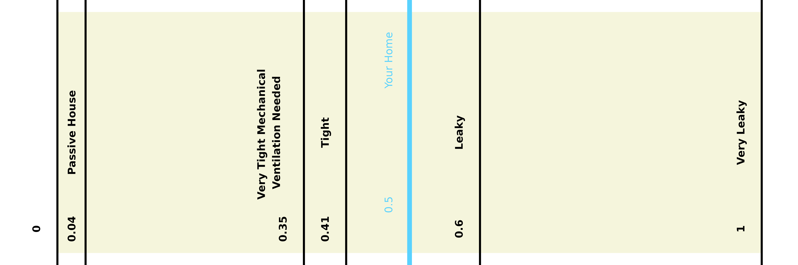

```{r}
#| label: enter row number
#| echo: false
#| eval: true

row_number <- 41 #enter row number from spreadsheet
report_number <- (row_number - 1)

```

```{r}
#| label: load packages
#| echo: false
#| warning: false

# load packages
if (!requireNamespace("flextable", quietly = TRUE)) {install.packages("flextable")}

library(flextable)
library(systemfonts)
library(officer)
library(readr)
library(here)
library(dplyr)
library(ggplot2)
library(stringr)
library(readxl)
library(tidyverse)
library(gridExtra)
library(grid)
library(jpeg)
library(cowplot)
library(googlesheets4)
library(reticulate)
library(gt)
library(tibble)
library(kableExtra)
library(janitor)
library(scales)
library(tidyr)

```

```{r}
#| label: load googlesheets data
#| echo: false
#| warning: false
#| eval: true

# load audit data
all_energy_test_googlesheets <- read_sheet("https://docs.google.com/spreadsheets/d/15TDUFfLuH6vbe5jwQaCYobvu17emCVfBTGN9KCwLEHk/edit?usp=sharing", col_types = "c")

energy_test_googlesheets <- all_energy_test_googlesheets[report_number, ] 
#to load the correct house subtract 1 from the row number in Google sheet
rm(all_energy_test_googlesheets)

clean_audit_data <- janitor::clean_names(energy_test_googlesheets)

# load recommendations info
recommendations_googlesheets <- read_sheet("https://docs.google.com/spreadsheets/d/1Fyc65ybuRoQoYVWC3yNA_os7pPTD1vaKKcWS3ZRB7UU/edit?usp=sharing", col_types = "c", sheet = 1 )

sect_4_problem_text_googlesheets <- read_sheet("https://docs.google.com/spreadsheets/d/1Fyc65ybuRoQoYVWC3yNA_os7pPTD1vaKKcWS3ZRB7UU/edit?usp=sharing", col_types = "c", sheet = 2)

sect_4_rec_text_googlesheets <- read_sheet("https://docs.google.com/spreadsheets/d/1Fyc65ybuRoQoYVWC3yNA_os7pPTD1vaKKcWS3ZRB7UU/edit?usp=sharing", col_types = "c", sheet = 3)

# load estimated recommendation info
estimated_recommedations_googlesheets <- read_sheet("https://docs.google.com/spreadsheets/d/1Fyc65ybuRoQoYVWC3yNA_os7pPTD1vaKKcWS3ZRB7UU/edit?usp=sharing", col_types = "c", sheet = 4)

# load additional resources info
additional_resources_googlesheets <- read_sheet("https://docs.google.com/spreadsheets/d/1Fyc65ybuRoQoYVWC3yNA_os7pPTD1vaKKcWS3ZRB7UU/edit?usp=sharing", col_types = "c", sheet = 5)

```

```{r}
#| label: setup rank recommendations data
#| echo: false
#| warning: false

# select only recommendations to make separate data frame
pivot_recommendations <- clean_audit_data |>
  select(c(recommendations_ranking_furnace_boiler_tune_up:recommendations_ranking_other_3, recommendations_ranking_ductwork_air_sealing_and_insulation:recommendations_ranking_replace_doors))

# pivot the data to be displayed vertically
pivot_recommendations <- pivot_recommendations |>
  pivot_longer(cols = everything(),
    names_to = "Rec_from_google_form", 
    values_to = "Rank")

# filter for only recs that have been selected
ranked_clean_recommendations <- recommendations_googlesheets |>
  bind_cols(pivot_recommendations)|>
  select(-c(Rec_from_google_form))|>
  filter(Rank != 0)|>
  select(-Rank)

```

```{r}
#| label: arrange section 2 text
#| echo: false
#| warning: false

# bind problem descriptions for summary of recs to summary of recs table
ranked_sect_4_problem_text <- sect_4_problem_text_googlesheets |>
  bind_cols(pivot_recommendations)|>
  select(-c(Rec_from_google_form))|>
  filter(Rank != 0)|>
  select(-Rank)

```

```{r}
#| label: basics setup
#| echo: false
#| warning: false
#| eval: true

# select only numerical basic data
energy_cost_quantity <- energy_test_googlesheets |>
  select(`Gallons of Heating Oil`,
         `Cost in Dollars (Heating Oil)`,
         `Gallons of Kerosene`,
         `Cost in Dollars (Kerosene)`,
         `Gallons of Propane`,
         `Cost in Dollars (Propane)`,
         `kWh of Electricity`,
         `Cost in Dollars (Electricity)`,
         `Cords of Firewood`,
         `Cost in Dollars (Firewood)`,
         `Tons of pellets`,
         `Cost in Dollars (Pellets)`,
         `Write the quantity and measuring unit`, 
         `Cost in Dollars (Other)` )

```

```{r}
#| label: energy sources gallons setup
#| echo: false

#select amount and pivot the energy sources using gallons 
gallon_sources <- energy_cost_quantity |>
  select('Gallons of Heating Oil', 'Gallons of Propane', 'Gallons of Kerosene')|>
    pivot_longer(cols = c('Gallons of Heating Oil', 'Gallons of Propane', 'Gallons of Kerosene' ),
      names_to = "Source", 
      values_to = "Amount")

#select cost and pivot the energy sources using gallons 
gallon_cost <- energy_cost_quantity|>
  select('Cost in Dollars (Heating Oil)', 'Cost in Dollars (Propane)', 'Cost in Dollars (Kerosene)')|>
    pivot_longer(cols = c('Cost in Dollars (Heating Oil)', 'Cost in Dollars (Propane)', 'Cost in Dollars (Kerosene)'),
      names_to = "Source_Cost", 
      values_to = "Dollars")

#filter sources that are not present in the house 
annual_totals_gallon <- gallon_sources |>
  cbind(gallon_cost) |>
    filter(Amount != is.na(NA))|>
      mutate(Anual_Totals = paste0(`Amount`, " Gallons,", `Dollars`, "USD"))

# make rows
annual_totals_gallon <- annual_totals_gallon |>
  mutate(Source = recode(Source,
                         'Gallons of Heating Oil' = 'Annual heating oil usage from bills:',
                         'Gallons of Propane' = 'Annual propane usage from bills:',
                         'Gallons of Kerosene' = 'Annual kerosene usage from the bills:'))

# remove unwanted rows
annual_totals_gallon <- annual_totals_gallon[, -c(2,3,4)]

```

```{r}
#| label: energy sources kWh setup
#| echo: false

kWh_sources <- energy_cost_quantity |>
  select('kWh of Electricity')|>
    pivot_longer(cols = c('kWh of Electricity'),
      names_to = "Source", 
      values_to = "Amount")

kWh_cost <- energy_cost_quantity|>
  select('kWh of Electricity')|>
    pivot_longer(cols = c('kWh of Electricity'),
      names_to = "Source_Cost", 
      values_to = "Dollars")

annual_totals_kWh <- kWh_sources |>
  cbind(gallon_cost) |>
    filter(Amount != is.na(NA))|>
      mutate(Anual_Totals = paste(`Amount`, " kWh,", `Dollars`, "USD"))|>
        mutate(Source = recode(Source, 'kWh of Electricity' = 'Annual electricity usage from bills:',))

#remove unwanted rows
annual_totals_kWh <- annual_totals_kWh[, -c(2,3,4)]

```

```{r}
#| label: energy sources cords setup
#| echo: false

cords_sources <- energy_cost_quantity |>
  select('Cords of Firewood')|>
    pivot_longer(cols = c('Cords of Firewood'),
      names_to = "Source", 
      values_to = "Amount")

cords_cost <- energy_cost_quantity|>
  select('Cords of Firewood')|>
    pivot_longer(cols = c('Cords of Firewood'),
      names_to = "Source_Cost", 
      values_to = "Dollars")

annual_totals_cords <- cords_sources |>
  cbind(cords_cost) |>
    filter(Amount != is.na(NA))|>
      mutate(Anual_Totals = paste(`Amount`, " Cords,", `Dollars`, "USD"))|>
        mutate(Source = recode(Source, 'Cords of Firewood' = 'Annual firewood usage from bills:',))

# remove unwanted rows
annual_totals_cords <- annual_totals_cords[, -c(2,3,4)]

```

```{r}
#| label: energy sources tons setup
#| echo: false

tons_sources <- energy_cost_quantity |>
  select('Tons of pellets')|>
    pivot_longer(cols = c('Tons of pellets'),
      names_to = "Source", 
      values_to = "Amount")

tons_cost <- energy_cost_quantity|>
  select('Tons of pellets')|>
    pivot_longer(cols = c('Tons of pellets'),
      names_to = "Source_Cost", 
      values_to = "Dollars")

annual_totals_tons <- tons_sources |>
  cbind(tons_cost) |>
    filter(Amount != is.na(NA))|>
      mutate(Anual_Totals = paste(`Amount`, " Tons,", `Dollars`, "USD"))|>
        mutate(Source = recode(Source,  'Tons of pellets' = 'Annual pellets usage from bills:',))

#remove unwanted rows
annual_totals_tons <- annual_totals_tons[, -c(2,3,4)]

```

```{r}
#| label: energy sources other setup
#| echo: false

other_sources <- energy_cost_quantity |>
  select('Write the quantity and measuring unit')|>
    pivot_longer(cols = c('Write the quantity and measuring unit'),
      names_to = "Source", 
      values_to = "Amount")

other_cost <- energy_cost_quantity|>
  select('Write the quantity and measuring unit')|>
    pivot_longer(cols = c('Write the quantity and measuring unit'),
      names_to = "Source_Cost", 
      values_to = "Dollars")

annual_totals_other <- other_sources |>
  cbind(other_cost) |>
    filter(Amount != is.na(NA))|>
      mutate(Anual_Totals = paste(`Amount`, `Dollars`, "USD"))|>
        mutate(Source = recode(Source,  'Write the quantity and measuring unit' = 'Other annual energy usage from bills:',))

# remove unwanted rows
annual_totals_other <- annual_totals_other[, -c(2,3,4)]

```

```{r}
#| label: annual totals for energy sources chapter 3 setup
#| echo: false
annual_totals <- annual_totals_kWh|>
  rbind(annual_totals_gallon, annual_totals_cords, annual_totals_tons )

names(annual_totals) <- c('Info', 'Values')

```

```{r}
#| label: basics table setup
#| echo: false

all_basics <- clean_audit_data |>
  
  select(
    date_built,
    number_of_floors,
    volume_of_conditioned_space_cubic_feet,
    square_footage_of_conditioned_space,
    ambient_carbon_monoxide_reading,
    foundation_type,
    net_wall_area_square_feet,
    homeowners_concerns,
    homeowners_comment_about_existing_insulation_air_sealing_when_was_it_done,
    any_additions_recent_renovations_construction,
    attic_insulation_type,
    thickness_of_the_attic_insulation_inches_at_the_thinnest_location) |>
  
  mutate(
    
    'Date Built:' = date_built,
    
    'Foundation Type:' = foundation_type,
    
    'Attic:' = ifelse(attic_insulation_type == "NONE",
                      paste0("The attic is uninsulated."),
                      paste0("Insulated with ",
                             attic_insulation_type,
                             " insulation, ",
                             thickness_of_the_attic_insulation_inches_at_the_thinnest_location,
                             " inches thick.")),
    
    'Number of Floors:' = number_of_floors,
    
    'Square Footage of Conditioned Space:' = paste0(comma(as.numeric(square_footage_of_conditioned_space), accuracy = 1), " ft²"),
    
    'Volume of Conditioned Space:' = paste0(comma(as.numeric(volume_of_conditioned_space_cubic_feet), accuracy = 1), " ft³"),
    
    'Net Wall Area:' = ifelse(is.na(net_wall_area_square_feet),
                              paste0(""),
                              paste0(comma(as.numeric(net_wall_area_square_feet), accuracy = 1), " ft²")),
    
    'Ambient Carbon Monoxide Reading:' = paste0(ambient_carbon_monoxide_reading, " parts per million"),
    
    'Homeowner Concerns:' = ifelse(is.na(homeowners_concerns),
                                   paste0(""),
                                   paste0(homeowners_concerns)),
    
    'Homeowner Comments:' = ifelse(is.na(homeowners_comment_about_existing_insulation_air_sealing_when_was_it_done),
                                   paste0(""),
                                   paste0(homeowners_comment_about_existing_insulation_air_sealing_when_was_it_done)),
    
    'Recent Construction:' = ifelse(is.na(any_additions_recent_renovations_construction),
                                    paste0(""),
                                    paste0(any_additions_recent_renovations_construction))
    
    ) |>
  
  
  select(
      'Date Built:', 
      'Foundation Type:', 
      'Number of Floors:', 
      'Attic:', 
      'Square Footage of Conditioned Space:', 
      'Volume of Conditioned Space:',
      'Net Wall Area:',
      'Ambient Carbon Monoxide Reading:',
      'Homeowner Concerns:',
      'Homeowner Comments:',
      'Recent Construction:') |>

pivot_longer(cols = everything(),
             names_to = "Info",
             values_to = "Values") |>
mutate(
  Info = factor(Info, levels = c(
    'Date Built:', 
    'Foundation Type:', 
    'Number of Floors:', 
    'Attic:', 
    'Square Footage of Conditioned Space:', 
    'Volume of Conditioned Space:',
    'Net Wall Area:',
    'Ambient Carbon Monoxide Reading:',
    'Homeowner Concerns:',
    'Homeowner Comments:',
    'Recent Construction:'))) |>
  
arrange(Info)

```

```{r}
#| label: exterior doors setup
#| echo: false
#| eval: true


exterior_doors <-clean_audit_data|>
  select(door_s_type_1, 
         door_s_type_2, 
         door_s_type_3, 
         door_s_material_1, 
         door_s_material_2, 
         door_s_material_3, 
         number_of_doors_of_this_type_1, 
         number_of_doors_of_this_type_2, 
         number_of_doors_of_this_type_3, 
         total_door_area_of_this_type_1, 
         total_door_area_of_this_type_2, 
         total_door_area_of_this_type_3, 
         condition_fit_of_the_doors_of_this_type_1, 
         condition_fit_of_the_doors_of_this_type_2, 
         condition_fit_of_the_doors_of_this_type_3)

exterior_doors <- exterior_doors|>
  mutate_all(~replace(., is.na(.), 0))

exterior_doors <- if (
  exterior_doors$number_of_doors_of_this_type_3 >= 1) {
    mutate(exterior_doors, Values = paste0("There are ", number_of_doors_of_this_type_1, " ",door_s_type_1," ", door_s_material_1, " exterior doors. These are in ", condition_fit_of_the_doors_of_this_type_1, " condition, they have a total area of ", total_door_area_of_this_type_1, " ft². ", "There are ",number_of_doors_of_this_type_2, " ",door_s_type_2," ", door_s_material_2, " exterior doors. These are in ", condition_fit_of_the_doors_of_this_type_2, " condition, they have a total area of ", total_door_area_of_this_type_2, " ft². There are ", number_of_doors_of_this_type_1, " ",door_s_type_1," ", door_s_material_1, " exterior doors. These are in ", condition_fit_of_the_doors_of_this_type_1, " condition, they have a total area of ", total_door_area_of_this_type_1, " ft²."))
} else if (
  exterior_doors$number_of_doors_of_this_type_2 >= 1) {
    mutate(exterior_doors, Values = paste0("There are ",number_of_doors_of_this_type_2, " ",door_s_type_2," ", door_s_material_2, " exterior doors. These are in ", condition_fit_of_the_doors_of_this_type_2, " condition, they have a total area of ", total_door_area_of_this_type_2, " ft². There are ", number_of_doors_of_this_type_1, " ",door_s_type_1," ", door_s_material_1, " exterior doors. These are in ", condition_fit_of_the_doors_of_this_type_1, " condition, they have a total area of ", total_door_area_of_this_type_1, " ft²."))
} else if (
  exterior_doors$number_of_doors_of_this_type_1 >= 1) {
    mutate(exterior_doors, Values = paste0("There are ",number_of_doors_of_this_type_1, " ",door_s_type_1," ", door_s_material_1, " exterior doors. These are in ", condition_fit_of_the_doors_of_this_type_1, " condition, they have a total area of ", total_door_area_of_this_type_1, " ft²."))
} else {
  mutate(exterior_doors, Values = paste0("There are no exterior doors??"))
}

exterior_doors <- exterior_doors|>
  select(-c(1:15))

exterior_doors <- exterior_doors|>
  pivot_longer(cols = Values ,
    names_to = "Info" ,
    values_to = "Values")|>
  mutate(Info = recode(Info,  'Values' = 'Exterior doors:',))

```

```{r}
#| label: windows setup
#| echo: false
#| eval: true


exterior_windows <-clean_audit_data|>
  select(how_many_windows_of_this_type_there_are_1, 
         how_many_windows_of_this_type_there_are_2, 
         how_many_windows_of_this_type_there_are_3, 
         how_many_windows_of_this_type_there_are_4, 
         how_many_windows_of_this_type_there_are_5, 
         number_of_panes_1, 
         number_of_panes_2, 
         number_of_panes_3, 
         number_of_panes_4, 
         number_of_panes_5, 
         material_of_the_windows_1, 
         material_of_the_windows_2, 
         material_of_the_windows_3, 
         material_of_the_windows_4, 
         material_of_the_windows_5, 
         condition_of_the_windows_of_this_type_1, 
         condition_of_the_windows_this_type_2, 
         condition_of_the_windows_this_type_3, 
         condition_of_the_windows_this_type_4, 
         condition_of_the_windows_this_type_5, 
         total_windows_areas_of_this_type_1, 
         total_windows_areas_of_this_type_2, 
         total_windows_areas_of_this_type_3, 
         total_windows_areas_of_this_type_4, 
         total_windows_areas_of_this_type_5,
         more_about_condition_of_the_windows_of_this_type_1,
         more_about_condition_of_the_windows_this_type_2,
         more_about_condition_of_the_windows_this_type_3,
         more_about_condition_of_the_windows_this_type_4,
         more_about_condition_of_the_windows_this_type_5)

exterior_windows <- exterior_windows |>
  mutate(across(c(
    how_many_windows_of_this_type_there_are_1,
    how_many_windows_of_this_type_there_are_2,
    how_many_windows_of_this_type_there_are_3,
    how_many_windows_of_this_type_there_are_4,
    how_many_windows_of_this_type_there_are_5,
    number_of_panes_1,
    number_of_panes_2,
    number_of_panes_3,
    number_of_panes_4,
    number_of_panes_5,
    total_windows_areas_of_this_type_1,
    total_windows_areas_of_this_type_2,
    total_windows_areas_of_this_type_3,
    total_windows_areas_of_this_type_4,
    total_windows_areas_of_this_type_5
  ), ~replace(., is.na(.), 0)))


exterior_windows <- if (
  exterior_windows$how_many_windows_of_this_type_there_are_5 >= 1) {
    mutate(exterior_windows, Values = paste0("There are ", how_many_windows_of_this_type_there_are_1 , " ", number_of_panes_1 ," paned ", material_of_the_windows_1, " windows. These are in ", condition_of_the_windows_of_this_type_1, " condition, they have a total area of ", total_windows_areas_of_this_type_1, " ft². ", more_about_condition_of_the_windows_of_this_type_1, ". There are ", how_many_windows_of_this_type_there_are_2, " ", number_of_panes_2, " paned ", material_of_the_windows_2, " windows. These are in ", condition_of_the_windows_this_type_2, " condition, they have a total area of ", total_windows_areas_of_this_type_2, " ft². ", more_about_condition_of_the_windows_this_type_2, ". There are " , how_many_windows_of_this_type_there_are_3, " ", number_of_panes_3, " paned ", material_of_the_windows_3, " windows. These are in ", condition_of_the_windows_this_type_3, " condition, they have a total area of ", total_windows_areas_of_this_type_3, " ft². ", more_about_condition_of_the_windows_this_type_3, ". There are ", , how_many_windows_of_this_type_there_are_4, " ", number_of_panes_4, " paned ", material_of_the_windows_4, " windows. These are in ", condition_of_the_windows_this_type_4, " condition, they have a total area of ", total_windows_areas_of_this_type_4, " ft². ", more_about_condition_of_the_windows_this_type_4, ". There are " , how_many_windows_of_this_type_there_are_5, " ", number_of_panes_5, " paned ", material_of_the_windows_5, " windows. These are in ", condition_of_the_windows_this_type_5, " condition, they have a total area of ", total_windows_areas_of_this_type_5, " ft². ", more_about_condition_of_the_windows_this_type_5, "."))
} else if (
  exterior_windows$how_many_windows_of_this_type_there_are_4 >= 1) {
    mutate(exterior_windows, Values = paste0("There are ", how_many_windows_of_this_type_there_are_1 , " ", number_of_panes_1 ," paned ", material_of_the_windows_1, " windows. These are in ", condition_of_the_windows_of_this_type_1, " condition, they have a total area of ", total_windows_areas_of_this_type_1, " ft². ", more_about_condition_of_the_windows_of_this_type_1, ". There are ", how_many_windows_of_this_type_there_are_2, " ", number_of_panes_2, " paned ", material_of_the_windows_2, " windows. These are in ", condition_of_the_windows_this_type_2, " condition, they have a total area of ", total_windows_areas_of_this_type_2, " ft². ", more_about_condition_of_the_windows_this_type_2, ". There are " , how_many_windows_of_this_type_there_are_3, " ", number_of_panes_3, " paned ", material_of_the_windows_3, " windows. These are in ", condition_of_the_windows_this_type_3, " condition, they have a total area of ", total_windows_areas_of_this_type_3, " ft². ", more_about_condition_of_the_windows_this_type_3, ". There are ", , how_many_windows_of_this_type_there_are_4, " ", number_of_panes_4, " paned ", material_of_the_windows_4, " windows. These are in ", condition_of_the_windows_this_type_4, " condition, they have a total area of ", total_windows_areas_of_this_type_4, " ft². ", more_about_condition_of_the_windows_this_type_4, "."))
} else if (
  exterior_windows$how_many_windows_of_this_type_there_are_3 >= 1) {
    mutate(exterior_windows, Values = paste0("There are ", how_many_windows_of_this_type_there_are_1 , " ", number_of_panes_1 ," paned ", material_of_the_windows_1, " windows. These are in ", condition_of_the_windows_of_this_type_1, " condition, they have a total area of ", total_windows_areas_of_this_type_1, " ft². ", more_about_condition_of_the_windows_of_this_type_1, ". There are ", how_many_windows_of_this_type_there_are_2, " ", number_of_panes_2, " paned ", material_of_the_windows_2, " windows. These are in ", condition_of_the_windows_this_type_2, " condition, they have a total area of ", total_windows_areas_of_this_type_2, " ft². ", more_about_condition_of_the_windows_this_type_2, ". There are " , how_many_windows_of_this_type_there_are_3, " ", number_of_panes_3, " paned ", material_of_the_windows_3, " windows. These are in ", condition_of_the_windows_this_type_3, " condition, they have a total area of ", total_windows_areas_of_this_type_3, " ft². ", more_about_condition_of_the_windows_this_type_3, "."))
} else if (
  exterior_windows$how_many_windows_of_this_type_there_are_2 >= 1) {
    mutate(exterior_windows, Values = paste0("There are ", how_many_windows_of_this_type_there_are_1 , " ", number_of_panes_1 ," paned ", material_of_the_windows_1, " windows. These are in ", condition_of_the_windows_of_this_type_1, " condition, they have a total area of ", total_windows_areas_of_this_type_1, " ft². ", more_about_condition_of_the_windows_of_this_type_1, ". There are ", how_many_windows_of_this_type_there_are_2, " ", number_of_panes_2, " paned ", material_of_the_windows_2, " windows. These are in ", condition_of_the_windows_this_type_2, " condition, they have a total area of ", total_windows_areas_of_this_type_2, " ft². ", more_about_condition_of_the_windows_this_type_2, "."))
} else if (
  exterior_windows$how_many_windows_of_this_type_there_are_1 >= 1) {
    mutate(exterior_windows, Values = paste0("There are ", how_many_windows_of_this_type_there_are_1 , " ", number_of_panes_1 ," paned ", material_of_the_windows_1, " windows. These are in ", condition_of_the_windows_of_this_type_1, " condition, they have a total area of ", total_windows_areas_of_this_type_1, " ft². ", more_about_condition_of_the_windows_of_this_type_1, "."))
} else {
  mutate(exterior_windows, Values = paste0("There are no exterior windows."))
}

exterior_windows <- exterior_windows|>
  select(-c(1:30))

exterior_windows <- exterior_windows|>
  pivot_longer(cols = Values ,
    names_to = "Info" ,
    values_to = "Values")|>
  mutate(Info = recode(Info,  'Values' = 'Exterior windows:',))

```

```{r}
#| label: exterior setup
#| echo: false

exterior_3.2 <- clean_audit_data|>
  select(roof_type, 
         roof_age, 
         condition_of_the_roof, 
         orientation_of_the_primary_roof_faces, 
         comment_about_condition_of_the_roof, 
         are_there_moisture_control_strategies,
         existing_moisture_control_strategies, 
         condition_of_moisture_control_strategies, 
         comments_about_existing_moisture_control_strategies,siding_type, 
         comment_about_condition_of_the_siding, 
         condition_of_the_siding)|>
  
  mutate(
    'Roof:'= paste0('The house has a ', roof_type, ' roof. ', 
                    ifelse(is.na(roof_age),
                           paste0('The age of the roof is unknown. '),
                           paste0('The roof is ', roof_age, ' years old. ')),
                    'It is in ', condition_of_the_roof ,' condition. ',
                    ifelse(is.na(comment_about_condition_of_the_roof),
                           paste0(""),
                           paste0(comment_about_condition_of_the_roof))),
    
    'Roof Orientation:' = ifelse(is.na(orientation_of_the_primary_roof_faces),
                                 paste0(""),
                                 paste0(orientation_of_the_primary_roof_faces)),
    
    'Siding:' = paste0('The house has ', siding_type,'. ', 
                       ifelse(is.na(condition_of_the_siding),
                              paste0(""),
                              paste0('The siding is in ', condition_of_the_siding, ' condition. ')),
                       ifelse(is.na(comment_about_condition_of_the_siding),
                              paste0(""),
                              paste0(comment_about_condition_of_the_siding))),
    
    'Moisture Control:' = ifelse(are_there_moisture_control_strategies == "No",
                                 paste0("There are no moisture control strategies. Moisture control is important to protect the exterior of the house and to limit the amount of moisture seeping into the foundation."),
                                 (ifelse(is.na(condition_of_moisture_control_strategies),
                                        paste0("The house has the following moisture control strategies: ", existing_moisture_control_strategies,".", (ifelse(is.na(comments_about_existing_moisture_control_strategies),
                                               paste0(""),
                                               paste0(comments_about_existing_moisture_control_strategies)))),
                                        paste0("The house has the following moisture control strategies: ", existing_moisture_control_strategies,'.  These were in ', condition_of_moisture_control_strategies, ' condition. ', (ifelse(is.na(comments_about_existing_moisture_control_strategies),
                                               paste0(""),
                                               paste0(comments_about_existing_moisture_control_strategies)))))))) |>

  select(`Roof:`,
         `Roof Orientation:`,
         `Siding:`,
         `Moisture Control:`)|>
  
pivot_longer(cols = everything() ,
    names_to = "Info" ,
    values_to = "Values")|>

rbind(exterior_doors, exterior_windows)

```

```{r}
#| label: interior setup
#| echo: false

all_interior <- clean_audit_data |>

  select(
    wall_stud_insulation_type, 
    thickness_of_the_wall_stud_insulation, 
    quality_of_wall_stud_insulations_installation_assess_worst_part_of_installation, 
    any_additional_comments_on_wall_stud_insulation, 
    wall_continuous_insulation_type, 
    thickness_of_the_wall_continuous_insulation, 
    quality_of_wall_continuous_insulations_installation_assess_worst_part_of_installation, 
    any_additional_comments_on_wall_continuous_insulation, 
    framing_type, 
    bathroom_fan_flow_box_readings,
    kitchen_fan_flow_box_readings,
    k_wh_reading_1, 
    k_wh_reading_2, 
    time_passed_since_installation_of_kilowatt_meter_1, 
    time_passed_since_installation_of_kilowatt_meter_2, 
    which_appliance_did_you_measure_1, 
    which_appliance_did_you_measure_2,
    general_comment_about_the_living_room, 
    general_comment_about_the_bathroom_s,
    general_comment_about_the_kitchen
  ) |>

  mutate(stock_framing = case_when(
    framing_type == "Balloon" ~ 'The house has balloon framing, which means the wall cavities extend the full height of the building (from the foundation to the roof). These wall cavities are often interconnected with the floor and ceiling cavities. This framing type can create connected passageways for air to leave the house and rodents to enter the house. ', 
    framing_type == "Platform" ~ 'The house has platform framing, which means that wall cavities do not extend the full height of the building, but are instead separated by floors. ', 
    framing_type == "Unsure / only one floor" ~ ' '),

  `Walls:` = ifelse(wall_stud_insulation_type == "NONE",
                    paste0(stock_framing, "The exterior walls are uninsulated. For reference, current Maine building code requires an R-value of at least R-13 with additional continuous insulation of R-10 for exterior walls or R-20 with additional continuous insulation of R-5. A material’s R-value tells us how good it is at stopping heat flow, the bigger the number, the better."),
                    paste0(
                          stock_framing, 
                          "The exterior wall stud cavities are insulated with ", wall_stud_insulation_type, 
                          " insulation. ",
                          (ifelse(is.na(thickness_of_the_wall_stud_insulation),
                                 paste0("The thickness of the insulation is unknown, but we estimate that it is around DECIDE inches thick."),
                                 paste0("This insulation is ", thickness_of_the_wall_stud_insulation, 
                                   " inches thick and in ", quality_of_wall_stud_insulations_installation_assess_worst_part_of_installation, 
                                   " condition. "))),
                          "This gives the exterior walls an R-value of around CALCULATE. A material’s R-value tells us how good it is at stopping heat flow—the bigger the number, the better. For comparison, current Maine building code requires an R-value of at least R-13 with additional continuous insulation of R-10 for exterior walls or R-20 with additional continuous insulation of R-5. ",
                          (ifelse(is.na(any_additional_comments_on_wall_stud_insulation),
                           paste0(""),
                           paste0(any_additional_comments_on_wall_stud_insulation))),
                        
                          (ifelse(wall_continuous_insulation_type == "NONE",
                              paste0(""),
                              paste0("The exterior walls also have a layer of continuous insulation. This is made up of ",
      wall_continuous_insulation_type,
      " that is ",
      thickness_of_the_wall_continuous_insulation,
      " inches thick and in ",
      quality_of_wall_continuous_insulations_installation_assess_worst_part_of_installation,
      " condition. This insulation adds an R-value of around CALCULATE to the walls.  For comparison, current Maine building code requires an R-value of at least R-13 with additional continuous insulation of R-10 for exterior walls or R-20 with additional continuous insulation of R-5. ", 
      any_additional_comments_on_wall_stud_insulation, any_additional_comments_on_wall_continuous_insulation))))),

  
`Kitchen:` = paste0(
              ifelse(!is.na(which_appliance_did_you_measure_1) & 
                     !is.na(k_wh_reading_1) & 
                     !is.na(time_passed_since_installation_of_kilowatt_meter_1),
                paste0(
                  'During the audit we measured the electricity consumption of the ', which_appliance_did_you_measure_1, 
                  ". It used ", k_wh_reading_1, " kWh in ", time_passed_since_installation_of_kilowatt_meter_1, 
                  " hours. We thus estimate that it is costing you around $CALCULATE a month to run. This is **comparable to / more expensive than** newer, efficient models. "),
                paste0("")),

            ifelse(!is.na(which_appliance_did_you_measure_2) & 
                   !is.na(k_wh_reading_2) & 
                   !is.na(time_passed_since_installation_of_kilowatt_meter_2),
              paste0(
                "The ", which_appliance_did_you_measure_2, " used ", k_wh_reading_2, " kWh in ", 
                time_passed_since_installation_of_kilowatt_meter_2, 
                " hours. We thus estimate that it is costing you around $CALCULATE a month to run. This is **comparable to / more expensive than** newer, efficient models. "),
              paste0("")),

            ifelse(!is.na(kitchen_fan_flow_box_readings),
              paste0(
                "We also measured the flow speed of your kitchen exhaust fans. Kitchen exhaust fans should have a flow of at least 100 cubic feet per minute (CFM). Your kitchen exhaust fan had a flow speed of ", 
              kitchen_fan_flow_box_readings, ". "),
              paste0("")),
  
            ifelse(!is.na(general_comment_about_the_kitchen),
              general_comment_about_the_kitchen,
              "")),
  
  `Bathroom(s):` = ifelse(is.na(bathroom_fan_flow_box_readings),
    ifelse(is.na(general_comment_about_the_bathroom_s),
           paste0(""),
           paste0(general_comment_about_the_bathroom_s)),
    paste0("We measured the flow speed of the bathroom exhaust fan(s). When there is a shower, bathroom exhaust fans should have a flow of at least 80 cubic feet per minute (CFM). Your fan(s) had a flow speed of ",
           bathroom_fan_flow_box_readings,
           ". ",
           ifelse(is.na(general_comment_about_the_bathroom_s),
                  "",
                  general_comment_about_the_bathroom_s)))) |>

  select(`Walls:`, `Kitchen:`, general_comment_about_the_living_room, `Bathroom(s):`) |>

  pivot_longer(cols = everything(),
               names_to = "Info",
               values_to = "Values") |>

  mutate(Info = recode(
    Info,
    general_comment_about_the_living_room = 'Living room:'
  )) |>

  arrange(factor(Info, levels = c('Walls:', 'Bathroom(s):', 'Kitchen:', 'Living room:')))


```

```{r}
#| label: blower door setup
#| eval: true
#| echo: false

# Calculate blower door metrics
table_3_4_basement <- clean_audit_data |>
  select(`cfm50`, `cfm50_basement`, `volume_of_conditioned_space_cubic_feet`) |>
  
  transmute(
    CFM50 = as.numeric(cfm50),
    ACH50 = CFM50 * 60 / as.numeric(volume_of_conditioned_space_cubic_feet),
    EquivalentLeakageArea = CFM50 / 10,
    CFM50B = as.numeric(cfm50_basement),
    ACH50B = CFM50B * 60 / as.numeric(volume_of_conditioned_space_cubic_feet),
    EquivalentLeakageAreaB = CFM50B / 10
  )

# Calculate N-factor
n_factor_calculated <- clean_audit_data |>
  transmute(
    exposure_of_the_house,
    number_of_floors,
    NFactor = case_when(
      exposure_of_the_house == "Low" & number_of_floors == 1 ~ 22.2,
      exposure_of_the_house == "Low" & number_of_floors == 1.5 ~ 20.0,
      exposure_of_the_house == "Low" & number_of_floors == 2 ~ 17.8,
      exposure_of_the_house == "Low" & number_of_floors == 3 ~ 15.5,
      exposure_of_the_house == "Moderate" & number_of_floors == 1 ~ 18.5,
      exposure_of_the_house == "Moderate" & number_of_floors == 1.5 ~ 16.7,
      exposure_of_the_house == "Moderate" & number_of_floors == 2 ~ 14.8,
      exposure_of_the_house == "Moderate" & number_of_floors == 3 ~ 13.0,
      exposure_of_the_house == "High" & number_of_floors == 1 ~ 16.7,
      exposure_of_the_house == "High" & number_of_floors == 1.5 ~ 15.0,
      exposure_of_the_house == "High" & number_of_floors == 2 ~ 13.3,
      exposure_of_the_house == "High" & number_of_floors == 3 ~ 11.7
    )
  )

# Combine and calculate ACHnatural
table_3_4_basement <- table_3_4_basement |>
  bind_cols(n_factor_calculated["NFactor"]) |>
  mutate(
    ACHnatural = ACH50 / NFactor,
    ACHnaturalBasement = ACH50B / NFactor,
    CFM50 = round(CFM50, 0),
    CFM50B = round(CFM50B, 0),
    ACH50 = round(ACH50, 0),
    ACH50B = round(ACH50B, 0),
    EquivalentLeakageArea = round(EquivalentLeakageArea, 0),
    EquivalentLeakageAreaB = round(EquivalentLeakageAreaB, 0),
    ACHnatural = round(ACHnatural, 2),
    ACHnaturalBasement = round(ACHnaturalBasement, 2)
  )

# Pivot longer
table_3_4_basement <- table_3_4_basement |>
  select(CFM50, ACH50, EquivalentLeakageArea, ACHnatural, CFM50B, ACH50B, EquivalentLeakageAreaB, ACHnaturalBasement) |>
  mutate(across(everything(), as.character)) |>
  pivot_longer(
    cols = everything(),
    names_to = "Info",
    values_to = "Values"
  )

# Extract numeric ACHnatural value and remove basement information
ACHnatural <- as.numeric(table_3_4_basement$Values[table_3_4_basement$Info == "ACHnatural"])
ACHnaturalBasement <- as.numeric(table_3_4_basement$Values[table_3_4_basement$Info == "ACHnaturalBasement"])

table_3_4 <- table_3_4_basement[-c(5:8), ]

# Calculate percentage
percentage <- round(ACHnatural * 100, 1)

# Format 'Values' column and relabel
table_3_4 <- table_3_4 |>
  mutate(
    Values = case_when(
      Info == "EquivalentLeakageArea" ~ paste0(Values, " in²"),
      TRUE ~ as.character(Values)
    ),
    Info = recode(
      Info,
      CFM50 = "CFM50:",
      ACH50 = "ACH50:",
      EquivalentLeakageArea = "Equivalent leakage area:",
      ACHnatural = "ACHnatural:"
    ),
    Info = factor(Info, levels = c(
      "CFM50:", 
      "ACH50:", 
      "Equivalent leakage area:", 
      "ACHnatural:"
      ))
  )

# Add the description vector with dynamic percentage and number of air changes per day
table_3_4$Description <- c(
  "CFM50 describes how many cubic feet per minute of air are leaving the house at 50 pascals of pressure difference (while the blower door is running). For every cubic foot of air that leaves the house, a cubic foot of air enters the house as well. The higher the number, the leakier the house.",
  "ACH50 tells us how many air changes per hour are taking place in the house at 50 pascals of pressure difference. This value is normalized for the volume of the house and thus allows for comparison between different houses. The higher the number, the leakier the house.",
  "This is the area equivalent to all of the air leaks in the house combined.",
  paste0(
    "Accounting for the volume of the home, this means that the house exchanges ",
    percentage, 
    "% of its air every hour. Over one day, the house goes through ", 
    round(ACHnatural * 24, 0), 
    " complete air changes.")
  )
```

```{r}
#| label: attic setup
#| echo: false

# pivot
attic_double <- energy_test_googlesheets|>
  select(`Attic Area`)|> 
  pivot_longer(c(`Attic Area`),
    names_to = "Info",
    values_to = "Values")

# select all attic questions
attic_character <- energy_test_googlesheets|>
  select(`Attic Area`, 
         `Does attic have air sealing?`, 
         `Comment about air sealing`, 
         `Any additional comments on attic insulation, e.g., is the entire attic insulated?`, 
         `Any hazards or mold/moisture/asbestos present in the attic?`, 
         `Describe the hazards or mold/moisture in the attic`, 
         `Is there ductwork in the attic?`, 
         `Comment about condition of the ductwork in the attic`,
         `Are bathroom and kitchen exhaust fans being vented to outside?`,
         `Attic ventilation type?`, 
         `Quality of attic insulation's installation? Assess worst part of installation.`,
         `Attic insulation type`, 
         `Thickness of the attic insulation (inches), at the thinnest location`, 
         `Attic hatch insulation type`, 
         `Thickness of the attic hatch insulation (inches), at the thinnest location`, 
         `Quality of attic hatch insulation's installation? Assess worst part of installation.`, 
         `Are there any interior features?`, 
         `Quality of attic insulation's installation? Assess worst part of installation.`, 
         `Any additional comments on attic insulation, e.g., is the entire attic insulated?`, 
         `Pitch of primary roof face (degrees)`, 
         `Are bathroom and kitchen exhaust fans being vented to outside?`)|>
  
# create all rows for table
    mutate(
      `Area:` = ifelse(is.na(`Attic Area`),
                       paste0(""),
                       paste0(comma(as.numeric(`Attic Area`), accuracy = 1), " ft²")),
  
      `Insulation Type:` = ifelse(`Attic insulation type` == "NONE",
                                  paste0("The attic is uninsulated. Attic insulation is important to keep your house cool in the summer and warm in the winter."),
                                  paste0("The attic is insulated with ", `Attic insulation type`, " insulation. The insulation is ", `Thickness of the attic insulation (inches), at the thinnest location`, " inches thick.")),
  
      `Insulation Condition:` = ifelse(is.na(`Quality of attic insulation's installation? Assess worst part of installation.`),
                                       paste0(""),
                                       paste0("The insulation is in ", `Quality of attic insulation's installation? Assess worst part of installation.`, " condition. ", `Any additional comments on attic insulation, e.g., is the entire attic insulated?`)),
        
  
      `Pitch of Primary Roof Face:` = ifelse(is.na(`Pitch of primary roof face (degrees)`),
                                             paste0(""),
                                             paste0("The pitch of the primary roof face is ", `Pitch of primary roof face (degrees)`, " degrees.")),
  
      `Exhaust Ducts:` = ifelse(is.na(`Are bathroom and kitchen exhaust fans being vented to outside?`),
                                paste0(""),
                                paste0("Exhaust ducts from bathroom and kitchen fans are ", `Are bathroom and kitchen exhaust fans being vented to outside?`, ". Venting exhaust fans to outside is important so that they do not add potentially harmful moisture into the attic space and so they can function properly.")),
  
      `R-Value:` = ifelse(`Attic insulation type` == "NONE",
                          paste0(""),
                          paste0("The thickness and condition of the insulation give the insulation an R-value of R-DECIDE per inch. This gives the attic a total R-value of R-CALCULATE. For comparison, current Maine building code requires an attic R-value of R-60, and we typically recommend at least R-80 in attics to keep the house warm in the winter and cool in the summer.")),
  
      `Air Sealing:` = ifelse(`Does attic have air sealing?` == "there is no attic space",
                              paste0(""),
                              paste0("The attic is ",`Does attic have air sealing?`,". ", ifelse(is.na(`Comment about air sealing`), "", `Comment about air sealing`))),

      `Attic Hatch:` = ifelse(`Attic hatch insulation type` == "NONE",
                              paste0("The attic hatch is uninsulated."),
                              paste0("The attic hatch is insulated with ", `Attic hatch insulation type`, " insulation that is ", `Thickness of the attic hatch insulation (inches), at the thinnest location`, " inches thick. The insulation is in ", `Quality of attic hatch insulation's installation? Assess worst part of installation.`, " condition and the hatch is **air sealed / not air sealed**.")),
  
      `Other observations:` = paste(`Any hazards or mold/moisture/asbestos present in the attic?`, `Describe the hazards or mold/moisture in the attic`, `Are there any interior features?`),
  
      `Ventilation:` = ifelse(`Attic ventilation type?` == "NONE",
                              paste0("The attic space is not ventilated. Attic ventilation is important to keep the attic space and insulation dry and in good condition."),
                              paste0("The attic is ventilated by ", `Attic ventilation type?`, ". Attic ventilation is important to keep the attic space and insulation dry and in good condition.")),
  
     `Ducts:` = ifelse(`Is there ductwork in the attic?` == "NONE",
                       paste0(""),
                       paste0(`Is there ductwork in the attic?`, ". ", `Comment about condition of the ductwork in the attic`)))


# format table
attic_character <- attic_character[, -c(1:9)]
  
attic_character <- attic_character|>
  pivot_longer(cols = everything(),
  names_to = "Info",
   values_to = "Values")

# set order
all_attic <- bind_rows(attic_double, attic_character) |>
  mutate(
    Info = factor(
      Info,
      levels = c(
        "Area:",
        "Pitch of Primary Roof Face:",
        "Insulation Type:",
        "Insulation Condition:",
        "R-Value:",
        "Air Sealing:",
        "Attic Hatch:",
        "Ventilation:",
        "Exhaust Ducts:",
        "Ducts:",
        "Other Observations:"
      )
    )
  ) |>
    arrange(Info) |>
      filter(!is.na(Info))
```

```{r}
#| label: basement setup
#| echo: false

all_basement <- clean_audit_data |>
  
# select columns about basement/crawlspace
  select(
    is_there_ductwork_in_the_basement_crawlspace,
    comment_about_ductwork_condition_in_the_basement_crawlspace,
    comment_about_the_basement_crawlspace_insulation,
    hazards_basement_crawlspace,
    any_hazards_or_mold_moisture_asbestos_present_in_the_basement_crawlspace,
    describe_the_hazards_or_mold_moisture_in_basement_crawlspace,
    quality_of_the_basement_crawlspace_insulations_installation_assess_worst_part_of_installation,
    moisture_and_mold_control_strategies,
    basement_crawlspace_insulation_type,
    insulation_of_appliances_in_basement_crawlspace,
    area_of_basement_crawlspace_ground_square_feet,
    thickness_of_basement_crawlspace_insulation,
    basement_crawlspace_net_wall_area,
    condition_of_moisture_control_strategies_in_the_basement_crawlspace,
    comments_about_existing_moisture_control_strategies,
  ) |>
  
# create rows
  mutate(
    `Area:` = ifelse(!is.na(area_of_basement_crawlspace_ground_square_feet), 
                     paste0(comma(as.numeric(area_of_basement_crawlspace_ground_square_feet), accuracy = 1), " ft²"), 
                     paste0("")),
    
    `Wall Area:` = ifelse(!is.na(basement_crawlspace_net_wall_area), 
                          paste0(comma(as.numeric(basement_crawlspace_net_wall_area), accuracy = 1), " ft²"), 
                          paste0("")),
    
    `Insulation Type:` = ifelse(basement_crawlspace_insulation_type == "NONE", 
                                paste0(""),
                                paste0(
                                  "The **basement / crawlspace** is insulated with ",
                                  basement_crawlspace_insulation_type,
                                  " insulation. The insulation is ",
                                  thickness_of_basement_crawlspace_insulation," inches thick.")),
    
    `Insulation Condition:` = ifelse(basement_crawlspace_insulation_type == "NONE", 
                                     paste0(""),
                                     paste0(
                                       "The insulation is in ",
                                       quality_of_the_basement_crawlspace_insulations_installation_assess_worst_part_of_installation,
                                       " condition. ",
                                       comment_about_the_basement_crawlspace_insulation)),
    
    `R-Value:` = ifelse(basement_crawlspace_insulation_type == "NONE", 
                                     paste0(""),
                        paste0(
                          "The thickness and condition of the insulation gives the insulation an R-value of R-DECIDE per inch. This gives the **basement / crawlspace** a total R-value of R-CALCULATE.")),
    
    `Moisture Control:` = ifelse(moisture_and_mold_control_strategies == "NONE",
                                 paste0("There are no moisture control strategies. Moisture control is important as moisture in the **basement / crawlspace** evaporates into the house where it can cause moisture damage such as mold. It is also important to protect appliances in the **basement / crawlspace**."),
                                  paste0(
                                   "There is ",
                                   moisture_and_mold_control_strategies,
                                   " to control moisture. These are in ",
                                   condition_of_moisture_control_strategies_in_the_basement_crawlspace,
                                   " condition. ",
                                   comments_about_existing_moisture_control_strategies,
                                   ". Moisture control is important as moisture in the **basement / crawlspace** evaporates into the house where it can cause moisture damage such as mold. It is also important to protect appliances in the **basement / crawlspace**.")),
    
    `Appliance Insulation:` = ifelse(insulation_of_appliances_in_basement_crawlspace == "NO DUCTWORK OR PIPES",
                                     paste0(""),
                                     paste0("The ",
                                            insulation_of_appliances_in_basement_crawlspace,
                                            ". DELETE WHAT DOESN'T APPLY. Insulating ductwork is important to prevent the air from losing heat as it travels through it. Insulating both hot and cold water pipes is important to stop the water from losing heat as it travels through the pipes and to prevent condensation. Uninsulated **ductwork / pipes** increase your heating bill.")),

    
    `Ducts:` = ifelse(is_there_ductwork_in_the_basement_crawlspace == "NONE",
                      paste0(""),
                      paste0(is_there_ductwork_in_the_basement_crawlspace,
                             " in the **basement / crawlspace**. ",
                             comment_about_ductwork_condition_in_the_basement_crawlspace)),
    
    `Other Observations:` = ifelse(any_hazards_or_mold_moisture_asbestos_present_in_the_basement_crawlspace == "Yes",
      paste0(
      "There is ",
      hazards_basement_crawlspace,
      describe_the_hazards_or_mold_moisture_in_basement_crawlspace),
      paste0(" "))) |>
  
# select columns
  select(
    `Area:`,
    `Wall Area:`,
    `Insulation Type:`,
    `Insulation Condition:`,
    `R-Value:`,
    `Moisture Control:`,
    `Appliance Insulation:`,
    `Ducts:`,
    `Other Observations:`
  ) |>
  
# pivot to long format
  pivot_longer(
    cols = everything(),
    names_to = "Info",
    values_to = "Values"
  ) |>
  
# arrange
  arrange(factor(Info, levels = c(
    "Area:",
    "Wall Area:",
    "Insulation Type:",
    "Insulation Condition:",
    "R-Value:",
    "Moisture Control:",
    "Appliance Insulation:",
    "Ducts:",
    "Other Observations:"
  )))

```

```{r}
#| label: mechanical systems setup
#| eval: true
#| echo: false

all_electrical_mechanical <- clean_audit_data |>
  
# select only needed columns
  select(
    amperage_of_breaker_panel, 
    number_of_unused_breaker_spaces, 
    comment_about_condition_of_the_panel_breakers_e_g_are_there_fuses_water_damage, 
    name_1, name_2, name_3,
    fuel_type_1, fuel_type_2, fuel_type_3,
    location_1, location_2, location_3,
    ventilation_1, ventilation_2, ventilation_3,
    worst_case_did_the_appliance_pass_spillage_test_1,
    worst_case_did_the_appliance_pass_spillage_test_2,
    worst_case_did_the_appliance_pass_spillage_test_3,
    efficiency_percent_1, efficiency_percent_2, efficiency_percent_3,
    air_free_co_reading_ppm_1, air_free_co_reading_ppm_2, air_free_co_reading_ppm_3,
    could_you_perform_combustion_safety_tests_in_worst_case_scenario_1,
    could_you_perform_combustion_safety_tests_in_worst_case_scenario_2,
    could_you_perform_combustion_safety_tests_in_worst_case_scenario_3,
    write_everything_about_other_appliances,
    is_a_c_used_in_the_building,
    how_frequently_is_a_c_used
  ) |>
  
mutate(
  `Electrical Panel:` = paste0(
    "The electrical panel has an amperage of ", 
    amperage_of_breaker_panel, 
    ". There are ", 
    number_of_unused_breaker_spaces, 
    " unused breaker spaces. ", 
    ifelse(is.na(comment_about_condition_of_the_panel_breakers_e_g_are_there_fuses_water_damage),
           "",
           comment_about_condition_of_the_panel_breakers_e_g_are_there_fuses_water_damage)),

  `Appliance 1:` = ifelse(
    could_you_perform_combustion_safety_tests_in_worst_case_scenario_1 == "Yes",
    paste0(
      "The ", name_1, " runs on ", fuel_type_1, 
      ". It is located in the ", location_1, 
      " and has ", ventilation_1, " ventilation. ",
      "We performed combustion safety tests on this appliance. ",
      "The appliance ", worst_case_did_the_appliance_pass_spillage_test_1, " the backdrafting test. ",
      "The backdrafting test verifies that combustion gasses are properly venting to the outside and not entering the living space. ",
      "The appliance had an efficiency of ", efficiency_percent_1, 
      "% and an air free carbon monoxide reading of ", air_free_co_reading_ppm_1, " parts per million. ",
      "MAKE COMMENTS ABOUT EFFICIENCY AND CO READING."
    ),
    paste0(
      "The ", name_1, " runs on ", fuel_type_1, 
      ". It is located in the ", location_1, 
      " and has ", ventilation_1, " ventilation."
    )
  ),

  `Appliance 2:` = ifelse(
    could_you_perform_combustion_safety_tests_in_worst_case_scenario_2 == "Yes",
    paste0(
      "The ", name_2, " runs on ", fuel_type_2, 
      ". It is located in the ", location_2, 
      " and has ", ventilation_2, " ventilation. ",
      "We performed combustion safety tests on this appliance. ",
      "The appliance ", worst_case_did_the_appliance_pass_spillage_test_2, " the backdrafting test. ",
      "The backdrafting test verifies that combustion gasses are properly venting to the outside and not entering the living space. ",
      "The appliance had an efficiency of ", efficiency_percent_2, 
      "% and an air free carbon monoxide reading of ", air_free_co_reading_ppm_2, " parts per million. ",
      "MAKE COMMENTS ABOUT EFFICIENCY AND CO READING."
    ),
    paste0(
      "The ", name_2, " runs on ", fuel_type_2, 
      ". It is located in the ", location_2, 
      " and has ", ventilation_2, " ventilation."
    )
  ),

  `Appliance 3:` = ifelse(
    could_you_perform_combustion_safety_tests_in_worst_case_scenario_3 == "Yes",
    paste0(
      "The ", name_3, " runs on ", fuel_type_3, 
      ". It is located in the ", location_3, 
      " and has ", ventilation_3, " ventilation. ",
      "We performed combustion safety tests on this appliance. ",
      "The appliance ", worst_case_did_the_appliance_pass_spillage_test_3, " the backdrafting test. ",
      "The backdrafting test verifies that combustion gasses are properly venting to the outside and not entering the living space. ",
      "The appliance had an efficiency of ", efficiency_percent_3, 
      "% and an air free carbon monoxide reading of ", air_free_co_reading_ppm_3, " parts per million. ",
      "MAKE COMMENTS ABOUT EFFICIENCY AND CO READING."
    ),
    paste0(
      "The ", name_3, " runs on ", fuel_type_3, 
      ". It is located in the ", location_3, 
      " and has ", ventilation_3, " ventilation."
    )
  ),

  `Other Combustion Appliances:` = write_everything_about_other_appliances,

  `Air Conditioning:` = paste0(
    ifelse(is_a_c_used_in_the_building == "None",
           paste0(""),
           paste0("The house is air conditioned using ", is_a_c_used_in_the_building, ". ",(ifelse(!is.na(how_frequently_is_a_c_used),  paste0("These are used ", how_frequently_is_a_c_used, ".")))))),


  `Other:` = paste0(
    "**Make rows for all other appliances including fridges, freezers, any combustion appliances that are not included above, electric heating, AC units, ...**"
  ))|>
  
  # select columns
  select(
    `Electrical Panel:`,
    `Appliance 1:`,
    `Appliance 2:`,
    `Appliance 3:`,
    `Other Combustion Appliances:`,
    `Air Conditioning:`,
    `Other:`
  ) |>
  
  # pivot
  pivot_longer(
    cols = everything(),
    names_to = "Info",
    values_to = "Values"
  ) |>
  
  # arrange
  arrange(factor(Info, levels = c(
    "Electrical Panel:",
    "Appliance 1:",
    "Appliance 2:",
    "Appliance 3:",
    "Other Combustion Appliances:",
    "Air Conditioning:",
    "Other:"
  )))

```

```{r}
#| label: energy setup
#| echo: false

# 1. Select and reshape quantity data
quantity_energy_bills <- clean_audit_data |>
  select(
    gallons_of_heating_oil,
    gallons_of_kerosene,
    gallons_of_propane,
    k_wh_of_electricity,
    cords_of_firewood,
    tons_of_pellets,
    write_the_quantity_and_measuring_unit
  ) |>
  pivot_longer(
    cols = everything(),
    names_to = "Type",
    values_to = "Amount"
  ) |>
  mutate(
    Type = recode(
      Type,
      gallons_of_heating_oil = "Heating Oil",
      gallons_of_kerosene = "Kerosene",
      gallons_of_propane = "Propane",
      k_wh_of_electricity = "Electricity",
      cords_of_firewood = "Firewood",
      tons_of_pellets = "Pellets",
      write_the_quantity_and_measuring_unit = "Other"
    )
  )

# 2. Select and reshape cost data
cost_energy_bills <- clean_audit_data |>
  select(
    cost_in_dollars_heating_oil,
    cost_in_dollars_kerosene,
    cost_in_dollars_propane,
    cost_in_dollars_electricity,
    cost_in_dollars_firewood,
    cost_in_dollars_pellets,
    cost_in_dollars_other
  ) |>
  pivot_longer(
    cols = everything(),
    names_to = "Type",
    values_to = "Cost"
  ) |>
  mutate(
    Type = recode(
      Type,
      cost_in_dollars_heating_oil = "Heating Oil",
      cost_in_dollars_kerosene = "Kerosene",
      cost_in_dollars_propane = "Propane",
      cost_in_dollars_electricity = "Electricity",
      cost_in_dollars_firewood = "Firewood",
      cost_in_dollars_pellets = "Pellets",
      cost_in_dollars_other = "Other"
    )
  )

# 3. Combine quantity and cost into one table and clean up
all_energy_bills <- left_join(quantity_energy_bills, cost_energy_bills, by = "Type") |>
  filter(!is.na(Amount) | !is.na(Cost)) |>
  mutate(
    Amount = comma(round(as.numeric(Amount), 0)),
    Cost = dollar(round(as.numeric(Cost), 0))
  )
```

```{r}
#| label: house image path setup
#| echo: false
#| warning: false

# Unique identifier for the image
image_id <- "House_photo_placeholder"

# Generate the file path for the image based on the identifier
image_path <- paste0("", image_id, ".png")


```

```{r, out.width = "50%", fig.align = 'center'}
#| label: image render
#| echo: false
#| warning: false
#| eval: false

# Include the image in the report
knitr::include_graphics(image_path,)
```

**Homeowner(s):** `r clean_audit_data$homeowner_s`\
**Address:** `r clean_audit_data$home_address`\
**Owner Contact:** `r clean_audit_data$homeowner_s_contact`\
**Auditors:** `r clean_audit_data$names_of_the_auditors`\
**Contact:** David Gibson, dgibson\@coa.edu, (802) 266-0301\
**Report Date:** `r format(Sys.time(), '%B %e, %Y')`

------------------------------------------------------------------------------------------------------------ <br>

*Add picture of home* <br>

------------------------------------------------------------------------------------------------------------<br>

We conducted an energy assessment of your home on `r clean_audit_data$date_of_audit`. This report will tell you what we did, what we found, and what we suggest for your home. These suggestions include information on incentives and financing to make improvements more affordable.<br>

------------------------------------------------------------------------------------------------------------<br>

{fig-align="center"}



**Add the table of contents: in Word go to REFERENCES and add table of contents, in Docs go to INSERT and add the table of contents**



## Summary of your Audit

### Visual Inspection and Measurements

We started with a tour and visual inspection of the inside and outside of the home. We identified any visible damage to the building, moisture control strategies, major appliances, and insulation. We measured square footage and volume of the home, as well as the area of all exterior windows and doors. We used a kill-a-watt meter to measure the electricity use of some appliances. During your audit, we used a carbon monoxide meter to measure the ambient carbon monoxide levels throughout the home.

### Attic

We entered the attic to check for insulation, air sealing, ventilation, and potential hazards such as mold. Additionally, we visually inspected the attic ventilation and any duct and pipework passing through the attic.

### Basement

We visually inspected any appliances in the basement and noted insulation levels, moisture, rodents, and any other concerns.

### Blower Door / Air Leakage Test

A blower door test measures the air tightness of a building. We used a specialized fan in an exterior door to generate negative pressure inside your house. The resulting pressure difference between the inside and outside of the house allows us to measure air leakage. To locate the leaks, we used an infrared camera to check for unusually hot and cold spots. We also checked the pressure differences of the rooms to help determine major air leak locations.

```{r}
#| label: data setup for 1.5 chapter
#| echo: false
#| eval: true
#| warning: false

chapter_1.5_header <- clean_audit_data |>
  mutate(combustion_fuels = str_detect(energy_sources, pattern = "[Hh]eat|Kerosene|Propane|Firewood|Pellets|Other"))

energy_sources_googlesheets <- clean_audit_data |>
  mutate(combustion_propane = str_detect(energy_sources, pattern = "Propane"))

clean_audit_data <- clean_audit_data|>
  mutate(combustionst1 = str_detect(could_you_perform_combustion_safety_tests_in_worst_case_scenario_1, pattern = "Yes")) |>

  mutate(could_you_perform_combustion_safety_tests_in_worst_case_scenario_1 = ifelse(is.na(could_you_perform_combustion_safety_tests_in_worst_case_scenario_1), 0, could_you_perform_combustion_safety_tests_in_worst_case_scenario_1))|>
  mutate(combustionst1 = str_detect(could_you_perform_combustion_safety_tests_in_worst_case_scenario_1, pattern = "Yes"))|>
  mutate(combustionst2 = str_detect(could_you_perform_combustion_safety_tests_in_worst_case_scenario_2, pattern = "Yes"))|>
  mutate(combustionst3 = str_detect(could_you_perform_combustion_safety_tests_in_worst_case_scenario_3, pattern = "Yes"))

  
```

```{r}
#| label: header chapter 1.5
#| echo: false
#| results: asis

if (chapter_1.5_header$combustion_fuels == TRUE) {
cat("### Combustion Appliance Safety")
} else {
cat(" ")
}
```

```{r}
#| label: text in 1.5 chapter
#| echo: false
#| warning: false
#| results: asis


if (clean_audit_data$combustionst1 == TRUE) {
  cat("We assessed combustion appliances that burn fossil fuels such as propane, heating oil, or kerosene. These include furnaces, boilers, water heaters, and gas ovens. We visually inspected the combustion appliance(s) in your home, as well as conducted combustion safety tests. This included measuring for carbon monoxide and testing that flue gases are properly exhausting from the home.")
}  else if (clean_audit_data$combustionst1 == FALSE) {
  cat("We assessed combustion appliances that burn fossil fuels such as propane, heating oil, or kerosene. These include furnaces, boilers, water heaters, and gas ovens. We visually inspected the combustion appliance(s) in your home, but we were unable to perform combustion safety tests.")
} else {
  cat("")
}
if(energy_sources_googlesheets$combustion_propane == TRUE){
  cat(" We also performed gas leak detection tests on your propane appliance(s).")
}else{
  cat("")
}

```



## Summary of Recommendations

We recommend the following upgrades for your home. Detailed information about these recommendations and financial resources can be found in other sections of this report. These are organized from the most important/easiest interventions to ones that are more challenging to implement.\
<br>

```{r}
#| label: summary of recs table
#| eval: true
#| echo: false
#| warning: false

my_border <- fp_border(color = "black", width = 1)

ft_summary_recs <- flextable(ranked_clean_recommendations) |>
  set_table_properties(width = 0.8, layout = "fixed") |> 
  
  # Set font and size
  fontsize(size = 11, part = "all") |>
  font(fontname = "Arial", part = "all") |>
  
  # Align text left and top
  align(align = "left", part = "all") |>
  valign(valign = "top", part = "all") |>
  
  # Column widths
  width(j = ~Recommendations, width = 2) |>
  width(j = ~Description, width = 4) |>
  
  # Enable padding (in pts)
  padding(padding.top = 4,
          padding.bottom = 4,
          padding.left = 4,
          padding.right = 4) |>

  border_remove() |>
  border_outer(border = my_border) |> 
  border_inner_h(border = my_border) |>
  border_inner_v(border = my_border)

ft_summary_recs

```



## What We Found

### Basics

```{r}
#| label: basics table
#| eval: true
#| echo: false

my_border <- fp_border(color = "black", width = 1)

ft_all_basics <- flextable(all_basics) |>
  delete_part(part = "header") |>
  set_table_properties(width = 0.8, layout = "fixed") |> 
  
  # Set font and size
  fontsize(size = 11, part = "all") |>
  font(fontname = "Arial", part = "all") |>
  
  # Align text left and top
  align(align = "left", part = "all") |>
  valign(valign = "top", part = "all") |>
  
  # Column widths
  width(j = ~Info, width = 2) |>
  width(j = ~Values, width = 4) |>
  
  # Enable padding (in pts)
  padding(padding.top = 4,
          padding.bottom = 4,
          padding.left = 4,
          padding.right = 4) |>

  border_remove() |>
  border_outer(border = my_border) |> 
  border_inner_h(border = my_border) |>
  border_inner_v(border = my_border)

ft_all_basics
```

### Exterior

```{r}
#| label: exterior table
#| eval: true
#| echo: false


my_border <- fp_border(color = "black", width = 1)

ft_exterior <- flextable(exterior_3.2) |>
  delete_part(part = "header") |>
  set_table_properties(width = 0.8, layout = "fixed") |> 
  
  # Set font and size
  fontsize(size = 11, part = "all") |>
  font(fontname = "Arial", part = "all") |>
  
  # Align text left and top
  align(align = "left", part = "all") |>
  valign(valign = "top", part = "all") |>
  
  # Column widths
  width(j = ~Info, width = 2) |>
  width(j = ~Values, width = 4) |>
  
  # Enable padding (in pts)
  padding(padding.top = 4,
          padding.bottom = 4,
          padding.left = 4,
          padding.right = 4) |>

  border_remove() |>
  border_outer(border = my_border) |> 
  border_inner_h(border = my_border) |>
  border_inner_v(border = my_border)


ft_exterior
```

### Interior/Living space

```{r}
#| label: interior table
#| eval: true
#| echo: false

my_border <- fp_border(color = "black", width = 1)

ft_interior <- flextable(all_interior) |>
  delete_part(part = "header") |>
  set_table_properties(width = 0.8, layout = "fixed") |> 
  
  # Set font and size
  fontsize(size = 11, part = "all") |>
  font(fontname = "Arial", part = "all") |>
  
  # Align text left and top
  align(align = "left", part = "all") |>
  valign(valign = "top", part = "all") |>
  
  # Column widths
  width(j = ~Info, width = 2) |>
  width(j = ~Values, width = 4) |>
  
  # Enable padding (in pts)
  padding(padding.top = 4,
          padding.bottom = 4,
          padding.left = 4,
          padding.right = 4) |>

  border_remove() |>
  border_outer(border = my_border) |> 
  border_inner_h(border = my_border) |>
  border_inner_v(border = my_border)

ft_interior
```

### Blower Door / Air Leakage Test

A blower door test simulates a 20mph wind hitting your house from all sides.

To run the test, we used a large fan in an exterior door to depressurize your house. As air is pulled out through the fan, an equal volume of air is pulled in through all of the gaps, cracks, and air leaks throughout the house. This allows us to determine the volume of air leakage into the house and to locate bigger air leaks.

To find leaks, we used an infrared camera to check for unusually hot and cold spots. We also checked the pressure differences of the rooms to help determine major air leak locations.

Air leaks are a big source of heat gain in warm weather and heat loss in cold weather. They also allow moisture to get into the home. Below are some numbers, pictures, and descriptions explaining what we found.\
<br>

```{r}
#| label: 3.5 blower door table
#| eval: true
#| echo: false

my_border <- fp_border(color = "black", width = 1)

ft_blower_door <- flextable(table_3_4) |>
  delete_part(part = "header") |>
  set_table_properties(width = 0.8, layout = "fixed") |> 
  
  # Set font and size
  fontsize(size = 11, part = "all") |>
  font(fontname = "Arial", part = "all") |>
  
  # Align text left and top
  align(align = "left", part = "all") |>
  valign(valign = "top", part = "all") |>
  
  # Column widths
  width(j = ~Info, width = 1) |>
  width(j = ~Values, width = 1) |>
  width(j = ~Description, width = 4) |>
  
  # Enable padding (in pts)
  padding(padding.top = 4,
          padding.bottom = 4,
          padding.left = 4,
          padding.right = 4) |>

  border_remove() |>
  border_outer(border = my_border) |> 
  border_inner_h(border = my_border) |>
  border_inner_v(border = my_border)

ft_blower_door

```

\
<br>

```{r}
#| label: blower door ACHnatural diagram
#| eval: true
#| echo: false
#| output: false

# Subset table to get just ACHnatural info
ACHnatural_ggplot <- table_3_4 |>
  filter(Info == "ACHnatural:") |>
  mutate(Values = as.numeric(Values))

# Define reference ACHn thresholds and their labels
thresholds <- c(0, 0.04, 0.35, 0.41, 0.6, 1)
labels <- c(
  "0" = "0",
  "0.04" = "Passive House",
  "0.35" = "Very Tight Mechanical\nVentilation Needed",
  "0.41" = "Tight",
  "0.6" = "Leaky",
  "1" = "Very Leaky"
)

# Base plot with empty bar for context
ggplot(ACHnatural_ggplot, aes(y = 1)) +
  # Background bar
  geom_bar(width = 0.5, fill = "#EDEDED") +

  # Your home's ACHn value line
  geom_vline(xintercept = ACHnatural_ggplot$Values, 
             linetype = 1, colour = "#1B9E77", size = 3) +

  # Reference threshold lines
  geom_vline(xintercept = thresholds, size = 1.3) +

  # Labels for "Your Home" and value
  geom_text(aes(x = Values, label = "Your Home", y = 1.15), 
            nudge_x = -0.03, colour = "#1B9E77", angle = 90, size = 5) +
  geom_text(aes(x = Values, label = round(Values, 2), y = 0.85), 
            nudge_x = -0.03, colour = "#1B9E77", angle = 90, size = 5) +

  # Labels for each reference line (description and numeric)
  geom_text(aes(x = 0, y = 1, label = labels["0"]), 
            nudge_x = -0.03, angle = 90, size = 5, fontface = "bold") +
  geom_text(aes(x = 0, y = 0.8, label = "0"), 
            nudge_x = -0.03, angle = 90, size = 5, fontface = "bold") +

  geom_text(aes(x = 0.04, y = 1, label = labels["0.04"]), 
            nudge_x = -0.02, angle = 90, size = 5, fontface = "bold") +
  geom_text(aes(x = 0.04, y = 0.8, label = "0.04"), 
            nudge_x = -0.02, angle = 90, size = 5, fontface = "bold") +

  geom_text(aes(x = 0.35, y = 1, label = labels["0.35"]), 
            nudge_x = -0.05, angle = 90, size = 5, fontface = "bold") +
  geom_text(aes(x = 0.35, y = 0.8, label = "0.35"), 
            nudge_x = -0.03, angle = 90, size = 5, fontface = "bold") +

  geom_text(aes(x = 0.41, y = 1, label = labels["0.41"]), 
            nudge_x = -0.03, angle = 90, size = 5, fontface = "bold") +
  geom_text(aes(x = 0.41, y = 0.8, label = "0.41"), 
            nudge_x = -0.03, angle = 90, size = 5, fontface = "bold") +

  geom_text(aes(x = 0.6, y = 1, label = labels["0.6"]), 
            nudge_x = -0.03, angle = 90, size = 5, fontface = "bold") +
  geom_text(aes(x = 0.6, y = 0.8, label = "0.6"), 
            nudge_x = -0.03, angle = 90, size = 5, fontface = "bold") +

  geom_text(aes(x = 1, y = 1, label = labels["1"]), 
            nudge_x = -0.03, angle = 90, size = 5, fontface = "bold") +
  geom_text(aes(x = 1, y = 0.8, label = "1"), 
            nudge_x = -0.03, angle = 90, size = 5, fontface = "bold") +

  # Minimal clean theme
  theme_void()

# Save as image
ggsave("achnatural_ggplot1.png", width = 15, height = 5)

```


\
<br>

```{r}
#| label: air leak comments
#| eval: true
#| echo: false
#| results: asis

airleaks_comments <- clean_audit_data$comments_about_air_leakage

airleaks_text <- ifelse(is.na(airleaks_comments), " ", airleaks_comments)

cat(airleaks_text)


```

```{r}
#| label: pressure differences
#| eval: true
#| echo: false
#| results: asis

pressure_pan <- clean_audit_data$pressure_pan_recordings
zonal_pressure <- clean_audit_data$zonal_pressure_difference

pressure_pan_text <- if (!is.na(pressure_pan)) {
  paste0("To test how leaky things like outlets and ductboots are, we measure the pressure difference between them and the house using a pressure pan. We measured ", pressure_pan, ". ")
} else {
  ""
}

zonal_pressure_text <- if (!is.na(zonal_pressure)) {
  paste0("By measuring the pressure difference between different rooms, we can test how leaky individual rooms are. Any room that has a pressure difference over 5 pascals has significant air leakage occuring in it. We measured ", zonal_pressure, ".")
} else {
  ""
}

cat(paste0(
  pressure_pan_text,
  zonal_pressure_text
))

```

```{r}
#| label: basement blower door
#| eval: true
#| echo: false
#| results: asis

b_ACHnat <- ACHnaturalBasement
b_comments <- clean_audit_data$comments_about_air_leakage_with_the_basement_door_open

if (!is.na(b_ACHnat)) {
  
  b_comments_text <- if (!is.na(b_comments)) {
    paste0(b_comments)
  } else {
    ""
  }
  
  cat(paste0(
    "To test how well the basement is air sealed, we open the interior door to the basement and record how leaky the house and basement are together. With the basement door open, your house had an ACHnatural value of ",
    b_ACHnat,
    ". ",
    b_comments_text
  ))
}


```

Using a thermal imaging camera, we looked for major air leakage locations and thermal bridging. Thermal bridging occurs when heat enters or leaves a house through material that lets heat through more easily than the house’s insulation. This often occurs with wall studs and ceiling joists.

We conducted the audit in the summer, when the air outside the house is hotter than inside the house. Therefore, the warmer (red, orange, and yellow) areas in the thermal pictures below show where air leakage and thermal bridging are taking place, as these are the areas where hot air and heat from the outside are being pulled into the cooler house.

ADD INFRARED IMAGES TABLE

### Attic

```{r}
#| label: 3.5 attic table
#| eval: true
#| echo: false
#| results: asis 


my_border <- fp_border(color = "black", width = 1)

ft_attic <- flextable(all_attic) |>
  delete_part(part = "header") |>
  set_table_properties(width = 0.8, layout = "fixed") |> 
  
  # Set font and size
  fontsize(size = 11, part = "all") |>
  font(fontname = "Arial", part = "all") |>
  
  # Align text left and top
  align(align = "left", part = "all") |>
  valign(valign = "top", part = "all") |>
  
  # Column widths
  width(j = ~Info, width = 2) |>
  width(j = ~Values, width = 4 )|>
  
  # Enable padding (in pts)
  padding(padding.top = 4,
          padding.bottom = 4,
          padding.left = 4,
          padding.right = 4) |>

  border_remove() |>
  border_outer(border = my_border) |> 
  border_inner_h(border = my_border) |>
  border_inner_v(border = my_border)

attic_q <- clean_audit_data$is_there_attic_space

attic_text <- if (attic_q == "No") {
  "The house has no attic space. ADD COMMENTS ABOUT IF ROOF IS INSULATED AND SEALED OR NOT"
} else if (attic_q == "Yes, there are multiple attics") {
  "The house has multiple attic spaces. DESCRIBE WHERE AND WHICH ONES THE INFORMATION BELOW IS ABOUT"
} else {
  ""
}

cat(attic_text, "\n\n")


if (attic_q != "No") {
  ft_attic
}


```

### Basement / Crawlspace

*If the house does not have a basement or crawlspace, change this section to be about foundation insulation and sealing, or get rid of it.*\
<br>

```{r}
#| label: 3.6 basement/crawlspace table
#| eval: true
#| echo: false

my_border <- fp_border(color = "black", width = 1)

ft_basement <- flextable(all_basement) |>
  delete_part(part = "header") |>
  set_table_properties(width = 0.8, layout = "fixed") |> 
  
  # Set font and size
  fontsize(size = 11, part = "all") |>
  font(fontname = "Arial", part = "all") |>
  
  # Align text left and top
  align(align = "left", part = "all") |>
  valign(valign = "top", part = "all") |>
  
  # Column widths
  width(j = ~Info, width = 2) |>
  width(j = ~Values, width = 4 )|>
  
  # Enable padding (in pts)
  padding(padding.top = 4,
          padding.bottom = 4,
          padding.left = 4,
          padding.right = 4) |>

  border_remove() |>
  border_outer(border = my_border) |> 
  border_inner_h(border = my_border) |>
  border_inner_v(border = my_border)

ft_basement
```

### Electrical and Mechanical Systems

```{r}
#| label: mechanical systems table
#| eval: true
#| echo: false

my_border <- fp_border(color = "black", width = 1)

ft_mechanic <- flextable(all_electrical_mechanical) |>
  delete_part(part = "header") |>
  set_table_properties(width = 0.8, layout = "fixed") |> 
  
  # Set font and size
  fontsize(size = 11, part = "all") |>
  font(fontname = "Arial", part = "all") |>
  
  # Align text left and top
  align(align = "left", part = "all") |>
  valign(valign = "top", part = "all") |>
  
  # Column widths
  width(j = ~Info, width = 2) |>
  width(j = ~Values, width = 4 )|>
  
  # Enable padding (in pts)
  padding(padding.top = 4,
          padding.bottom = 4,
          padding.left = 4,
          padding.right = 4) |>

  border_remove() |>
  border_outer(border = my_border) |> 
  border_inner_h(border = my_border) |>
  border_inner_v(border = my_border)

ft_mechanic
```

### Energy Bills

```{r}
#| label: energy table
#| eval: true
#| echo: false

my_border <- fp_border(color = "black", width = 1)

ft_energy <- flextable(all_energy_bills) |>
  set_table_properties(width = 0.8, layout = "fixed") |> 
  
  # Set font and size
  fontsize(size = 11, part = "all") |>
  font(fontname = "Arial", part = "all") |>
  
  # Align text left and top
  align(align = "left", part = "all") |>
  valign(valign = "top", part = "all") |>
  
  # Column widths
  width(j = ~Type, width = 2) |>
  width(j = ~Amount, width = 2 )|>
  width(j = ~Cost, width = 2 )|>
  
  # Enable padding (in pts)
  padding(padding.top = 4,
          padding.bottom = 4,
          padding.left = 4,
          padding.right = 4) |>

  border_remove() |>
  border_outer(border = my_border) |> 
  border_inner_h(border = my_border) |>
  border_inner_v(border = my_border)

ft_energy

```

```{r}
#| label: last comments
#| eval: true
#| echo: false
#| results: asis

last_comments <- clean_audit_data$last_comments
last_questions <- clean_audit_data$last_questions_from_homeowners

output <- ""

if (!is.na(last_comments)) {
  output <- paste0(output, last_comments, ". ")
}

if (!is.na(last_questions)) {
  output <- paste0(output, last_questions)
}

cat(output)

```



## Recommendations

These recommendations are organized from the most effective and easiest interventions to ones that are more challenging to implement.

```{r}
#| label: setup data for recommendations 4.0
#| echo: false
#| eval: true

furnace_boiler_tune_up <- clean_audit_data|>
  select(recommendations_ranking_furnace_boiler_tune_up)|>
  mutate(furnace_boiler_tune_up = str_detect(recommendations_ranking_furnace_boiler_tune_up, pattern = "^0", negate = TRUE))|>
  select(-recommendations_ranking_furnace_boiler_tune_up)

high_efficiency_shower_heads<- clean_audit_data|>
  select(recommendations_ranking_high_efficiency_showerhead_s)|>
  mutate(high_efficiency_shower_heads = str_detect(recommendations_ranking_high_efficiency_showerhead_s, pattern = "^0", negate = TRUE))|>
  select(-recommendations_ranking_high_efficiency_showerhead_s)

led<- clean_audit_data|>
  select(recommendations_ranking_le_ds)|>
  mutate(led = str_detect(recommendations_ranking_le_ds, pattern = "^0", negate = TRUE))|>
  select(-recommendations_ranking_le_ds)

window_dressers <- clean_audit_data|>
  select(recommendations_ranking_window_dressers)|>
  mutate(window_dressers = str_detect(recommendations_ranking_window_dressers, pattern = "^0", negate = TRUE))|>
  select(-recommendations_ranking_window_dressers)

refrigerator <- clean_audit_data|>
  select(recommendations_ranking_refrigerator)|>
  mutate(refrigerator = str_detect(recommendations_ranking_refrigerator, pattern = "^0", negate = TRUE))|>
  select(-recommendations_ranking_refrigerator)

 freezer<- clean_audit_data|>
  select(recommendations_ranking_freezer)|>
  mutate(freezer = str_detect(recommendations_ranking_freezer, pattern = "^0", negate = TRUE))|>
  select(-recommendations_ranking_freezer)
 
induction_stove<- clean_audit_data|>
  select(recommendations_ranking_induction_stove_oven)|>
  mutate(induction_stove = str_detect(recommendations_ranking_induction_stove_oven, pattern = "^0", negate = TRUE))|>
  select(-recommendations_ranking_induction_stove_oven)

heatpwh <- clean_audit_data|>
  select(recommendations_ranking_heat_pump_water_heater)|>
  mutate(heatpwh = str_detect(recommendations_ranking_heat_pump_water_heater, pattern = "^0", negate = TRUE))|>
  select(-recommendations_ranking_heat_pump_water_heater)

gutters <- clean_audit_data|>
  select(recommendations_ranking_gutters)|>
  mutate(gutters= str_detect(recommendations_ranking_gutters, pattern = "^0", negate = TRUE))|>
  select(-recommendations_ranking_gutters)

bathroom_exhaust_fan <- clean_audit_data|>
  select(recommendations_ranking_bathroom_exhaust_fan_s)|>
  mutate(bathroom_exhaust_fan = str_detect(recommendations_ranking_bathroom_exhaust_fan_s, pattern = "^0", negate = TRUE))|>
  select(-recommendations_ranking_bathroom_exhaust_fan_s)

kitchen_exhaust_fan <- clean_audit_data|>
  select(recommendations_ranking_kitchen_exhaust_fan)|>
  mutate(kitchen_exhaust_fan= str_detect(recommendations_ranking_kitchen_exhaust_fan, pattern = "^0", negate = TRUE))|>
  select(-recommendations_ranking_kitchen_exhaust_fan)

vapor_barrier <- clean_audit_data|>
  select(recommendations_ranking_vapor_barrier)|>
  mutate(vapor_barrier = str_detect(recommendations_ranking_vapor_barrier, pattern = "^0", negate = TRUE))|>
  select(-recommendations_ranking_vapor_barrier)

spray_foam <- clean_audit_data|>
  select(recommendations_ranking_spray_foam_basement_crawlspace_walls)|>
  mutate(spray_foam = str_detect(recommendations_ranking_spray_foam_basement_crawlspace_walls, pattern = "^0", negate = TRUE))|>
  select(-recommendations_ranking_spray_foam_basement_crawlspace_walls)

attic_air_sealing_and_insulation <- clean_audit_data|>
  select(recommendations_ranking_attic_insulation_and_air_sealing)|>
  mutate(attic_air_sealing_and_insulation = str_detect(recommendations_ranking_attic_insulation_and_air_sealing, pattern = "^0", negate = TRUE))|>
  select(-recommendations_ranking_attic_insulation_and_air_sealing)

wall_stud_insulation <- clean_audit_data|>
  select(recommendations_ranking_blown_in_cellulose_wall_insulation)|>
  mutate(wall_stud_insulation = str_detect(recommendations_ranking_blown_in_cellulose_wall_insulation, pattern = "^0", negate = TRUE))|>
  select(-recommendations_ranking_blown_in_cellulose_wall_insulation)

continuous_wall_insulation <- clean_audit_data|>
  select(recommendations_ranking_continuous_exterior_wall_insulation)|>
  mutate(continuous_wall_insulation = str_detect(recommendations_ranking_continuous_exterior_wall_insulation, pattern = "^0", negate = TRUE))|>
  select(-recommendations_ranking_continuous_exterior_wall_insulation)

electrical_panel <- clean_audit_data|>
  select(recommendations_ranking_electrical_panel_upgrade)|>
  mutate(electrical_panel = str_detect(recommendations_ranking_electrical_panel_upgrade, pattern = "^0", negate = TRUE))|>
  select(-recommendations_ranking_electrical_panel_upgrade)

airsource_hp <- clean_audit_data|>
  select(recommendations_ranking_air_source_heat_pump)|>
  mutate(airsource_hp = str_detect(recommendations_ranking_air_source_heat_pump, pattern = "^0", negate = TRUE))|>
  select(-recommendations_ranking_air_source_heat_pump)

ev <- clean_audit_data|>
  select(recommendations_ranking_ev_and_charger)|>
  mutate(ev = str_detect(recommendations_ranking_ev_and_charger, pattern = "^0", negate = TRUE))|>
  select(-recommendations_ranking_ev_and_charger)

solar <- clean_audit_data|>
  select(recommendations_ranking_solar)|>
  mutate(solar = str_detect(recommendations_ranking_solar, pattern = "^0", negate = TRUE))|>
  select(-recommendations_ranking_solar)

pipe_insulation <- clean_audit_data|>
  select(recommendations_ranking_pipe_insulation)|>
  mutate(pipe_insulation = str_detect(recommendations_ranking_pipe_insulation, pattern = "^0", negate = TRUE))|>
  select(-recommendations_ranking_pipe_insulation)

whole_house_surge_protection <- clean_audit_data|>
  select(recommendations_ranking_whole_house_surge_protection)|>
  mutate(whole_house_surge_protection = str_detect(recommendations_ranking_whole_house_surge_protection, pattern = "^0", negate = TRUE))|>
  select(-recommendations_ranking_whole_house_surge_protection)

diy_air_sealing <- clean_audit_data|>
  select(recommendations_ranking_diy_air_sealing)|>
  mutate(diy_air_sealing = str_detect(recommendations_ranking_diy_air_sealing, pattern = "^0", negate = TRUE))|>
  select(-recommendations_ranking_diy_air_sealing)

duct_air_sealing_and_insulation <- clean_audit_data|>
  select(recommendations_ranking_ductwork_air_sealing_and_insulation)|>
  mutate(duct_air_sealing_and_insulation = str_detect(recommendations_ranking_ductwork_air_sealing_and_insulation, pattern = "^0", negate = TRUE))|>
  select(-recommendations_ranking_ductwork_air_sealing_and_insulation)

other_1 <- clean_audit_data|>
  select(recommendations_ranking_other_1)|>
  mutate(other_1 = str_detect(recommendations_ranking_other_1, pattern = "^0", negate = TRUE))|>
  select(-recommendations_ranking_other_1)

other_2 <- clean_audit_data|>
  select(recommendations_ranking_other_2)|>
  mutate(other_2 = str_detect(recommendations_ranking_other_2, pattern = "^0", negate = TRUE))|>
  select(-recommendations_ranking_other_2)

other_3 <- clean_audit_data|>
  select(recommendations_ranking_other_3)|>
  mutate(other_3 = str_detect(recommendations_ranking_other_3, pattern = "^0", negate = TRUE))|>
  select(-recommendations_ranking_other_3)

misc_air_sealing_insulation <- clean_audit_data|>
  select(recommendations_ranking_misc_air_sealing_and_insulation)|>
  mutate(other_3 = str_detect(recommendations_ranking_misc_air_sealing_and_insulation, pattern = "^0", negate = TRUE))|>
  select(-recommendations_ranking_misc_air_sealing_and_insulation)

replace_windows <- clean_audit_data|>
  select(recommendations_ranking_replace_windows)|>
  mutate(other_3 = str_detect(recommendations_ranking_replace_windows, pattern = "^0", negate = TRUE))|>
  select(-recommendations_ranking_replace_windows)

replace_doors <- clean_audit_data|>
  select(recommendations_ranking_replace_doors)|>
  mutate(other_3 = str_detect(recommendations_ranking_replace_doors, pattern = "^0", negate = TRUE))|>
  select(-recommendations_ranking_replace_doors)

```

```{r}
#| label: automatic recomendation description text set up 
#| echo: false
auto_refrigerator <-  sect_4_rec_text_googlesheets[5, ]

auto_freezer <- sect_4_rec_text_googlesheets[6,]

auto_induction_stove <- sect_4_rec_text_googlesheets[7, ]

auto_vapor_barrier <- sect_4_rec_text_googlesheets[12, ]

auto_spray_foam <- sect_4_rec_text_googlesheets[13, ]

auto_attic_insulation <- sect_4_rec_text_googlesheets[14, ]

auto_blow_in_cellulose <- sect_4_rec_text_googlesheets[15, ]

auto_continuous_exterior_insulation <- sect_4_rec_text_googlesheets[16, ]

auto_electrical_panel_upgrade <- sect_4_rec_text_googlesheets[17, ]

auto_air_source_heat_pump <- sect_4_rec_text_googlesheets[18, ]

auto_ev_and_charger <- sect_4_rec_text_googlesheets[19, ]

auto_other_1 <- sect_4_rec_text_googlesheets[24, ]

auto_leds <- sect_4_rec_text_googlesheets[3, ]

auto_shower_heads <- sect_4_rec_text_googlesheets[2, ]

auto_furnace_boiler_tune_up <- sect_4_rec_text_googlesheets[1, ]

auto_window_dressers <- sect_4_rec_text_googlesheets[4, ]

auto_heat_pump_water_heater <- sect_4_rec_text_googlesheets[8, ]

auto_gutters <- sect_4_rec_text_googlesheets[9, ]

auto_bathroom_fan <- sect_4_rec_text_googlesheets[10, ]

auto_kitchen_fan <- sect_4_rec_text_googlesheets[11, ]

auto_solar <- sect_4_rec_text_googlesheets[20, ]

auto_pipe_insulation <- sect_4_rec_text_googlesheets[21, ]

auto_whole_house_surge_protection <- sect_4_rec_text_googlesheets[23, ]

auto_diy_air_sealing <- sect_4_rec_text_googlesheets[22, ]

auto_duct_air_sealing <- sect_4_rec_text_googlesheets[27,]

auto_other_2 <- sect_4_rec_text_googlesheets[25, ]

auto_other_3 <- sect_4_rec_text_googlesheets[26, ]

auto_misc_air_sealing_insulation <- sect_4_rec_text_googlesheets[28, ]

auto_replace_windows <- sect_4_rec_text_googlesheets[29, ]

auto_replace_doors <- sect_4_rec_text_googlesheets[30, ]
```

```{r}
#| label: automatic estimates/costs for recomendation stock text set up
#| echo: false
#| eval: true

residency_type <- clean_audit_data|>
  select(type_of_the_residence)

#identify the type of residence
primery_residence <- residency_type |>
  mutate(type_of_the_residence = str_detect(type_of_the_residence, pattern = "Primary Residence"))

secondary_residence_heated <- residency_type |>
  mutate(type_of_the_residence = str_detect(type_of_the_residence, pattern = "Secondary Residence, heated year-round"))

secondary_residence_not_heated <- residency_type |>
  mutate(type_of_the_residence = str_detect(type_of_the_residence, pattern = "Secondary Residence, not heated year-round"))

#slice all the recommendations 
auto_furnace_boiler_tune_estimates <- estimated_recommedations_googlesheets|>
  slice(1:3)

auto_shower_heads_estimates <-estimated_recommedations_googlesheets|>
  slice(4:6)

auto_LED_s_estimates  <- estimated_recommedations_googlesheets|>
  slice(7:9)

auto_window_dressers_estimates <- estimated_recommedations_googlesheets|>
  slice(10:12)

auto_refrigerator_estimates <- estimated_recommedations_googlesheets|>
  slice(13:15)

auto_freezer_estimates <- estimated_recommedations_googlesheets|>
  slice(16:18)

auto_induction_stove_estimates <- estimated_recommedations_googlesheets|>
  slice(19:21)

auto_heat_pump_water_heater_estimates <- estimated_recommedations_googlesheets|>
  slice(22:24)

auto_gutters_estimates <- estimated_recommedations_googlesheets|>
  slice(25:27)

auto_bathroom_fan_estimates <- estimated_recommedations_googlesheets|>
  slice(28:30)

auto_kitchen_fan_estimates  <- estimated_recommedations_googlesheets|>
  slice(31:33)

auto_vapor_barrier_estimates  <- estimated_recommedations_googlesheets|>
  slice(34:36)

auto_spray_foam_estimates  <- estimated_recommedations_googlesheets|>
  slice(37:39)

auto_attic_air_sealing_insulation_estimates  <- estimated_recommedations_googlesheets|>
  slice(40:42)

auto_blow_in_cellulose_estimates  <- estimated_recommedations_googlesheets|>
  slice(43:45)

auto_continuous_exterior_insulation_estimates  <- estimated_recommedations_googlesheets|>
  slice(46:48)

auto_electrical_panel_upgrade_estimates <- estimated_recommedations_googlesheets|>
  slice(49:51)

auto_air_source_heat_pump_estimates  <- estimated_recommedations_googlesheets|>
  slice(52:54)

auto_ev_and_charger_estimates <- estimated_recommedations_googlesheets|>
  slice(55:57)

auto_solar_estimates <- estimated_recommedations_googlesheets|>
  slice(58:60)

auto_whole_house_surge_protection_estimates <- estimated_recommedations_googlesheets|>
  slice(61:63)

auto_pipe_insulation_estimates <- estimated_recommedations_googlesheets|>
  slice(64:66)

auto_diy_air_sealing <- estimated_recommedations_googlesheets|>
  slice(67:69)

auto_other_1_estimates <- estimated_recommedations_googlesheets|>
  slice(70:72)

auto_other_2_estimates <- estimated_recommedations_googlesheets|>
  slice(73:75)

auto_other_3_estimates <- estimated_recommedations_googlesheets|>
  slice(76:78)

auto_duct_air_sealing_insulation_estimates <- estimated_recommedations_googlesheets|>
  slice(79:81)

auto_misc_air_sealing_insulation_estimates  <- estimated_recommedations_googlesheets|>
  slice(82:84)

auto_replace_windows_estimates <- estimated_recommedations_googlesheets|>
  slice(85:87)

auto_replace_doors_estimates <- estimated_recommedations_googlesheets|>
  slice(88:90)

#automate the correct description
auto_furnace_boiler_tune_estimates <- if (primery_residence == TRUE) {
  mutate(auto_furnace_boiler_tune_estimates, Description = paste0(auto_furnace_boiler_tune_estimates[1,4]))
} else if (secondary_residence_heated == TRUE) {
  mutate(auto_furnace_boiler_tune_estimates, Description = paste0(auto_furnace_boiler_tune_estimates[2,4]))
} else {
  mutate(auto_furnace_boiler_tune_estimates, Description = paste0(auto_furnace_boiler_tune_estimates[3,4]))
}

auto_shower_heads_estimates <- if (primery_residence == TRUE) {
  mutate(auto_shower_heads_estimates, Description = paste0(auto_shower_heads_estimates[1,4]))
} else if (secondary_residence_heated == TRUE) {
  mutate(auto_shower_heads_estimates, Description = paste0(auto_shower_heads_estimates[2,4]))
} else {
  mutate(auto_shower_heads_estimates, Description = paste0(auto_shower_heads_estimates[3,4]))
}

auto_LED_s_estimates <- if (primery_residence == TRUE) {
  mutate(auto_LED_s_estimates, Description = paste0(auto_LED_s_estimates[1,4]))
} else if (secondary_residence_heated == TRUE) {
  mutate(auto_LED_s_estimates, Description = paste0(auto_LED_s_estimates[2,4]))
} else {
  mutate(auto_LED_s_estimates, Description = paste0(auto_LED_s_estimates[3,4]))
}

auto_window_dressers_estimates <- if (primery_residence == TRUE) {
  mutate(auto_window_dressers_estimates, Description = paste0(auto_window_dressers_estimates[1,4]))
} else if (secondary_residence_heated == TRUE) {
  mutate(auto_window_dressers_estimates, Description = paste0(auto_window_dressers_estimates[2,4]))
} else {
  mutate(auto_window_dressers_estimates, Description = paste0(auto_window_dressers_estimates[3,4]))
}

auto_refrigerator_estimates <- if (primery_residence == TRUE) {
  mutate(auto_refrigerator_estimates, Description = paste0(auto_refrigerator_estimates[1,4]))
} else if (secondary_residence_heated == TRUE) {
  mutate(auto_refrigerator_estimates, Description = paste0(auto_refrigerator_estimates[2,4]))
} else {
  mutate(auto_refrigerator_estimates, Description = paste0(auto_refrigerator_estimates[3,4]))
}

auto_freezer_estimates <- if (primery_residence == TRUE) {
  mutate(auto_freezer_estimates, Description = paste0(auto_freezer_estimates[1,4]))
} else if (secondary_residence_heated == TRUE) {
  mutate(auto_freezer_estimates, Description = paste0(auto_freezer_estimates[2,4]))
} else {
  mutate(auto_freezer_estimates, Description = paste0(auto_freezer_estimates[3,4]))
}

auto_induction_stove_estimates <- if (primery_residence == TRUE) {
  mutate(auto_induction_stove_estimates, Description = paste0(auto_induction_stove_estimates[1,4]))
} else if (secondary_residence_heated == TRUE) {
  mutate(auto_induction_stove_estimates, Description = paste0(auto_induction_stove_estimates[2,4]))
} else {
  mutate(auto_induction_stove_estimates, Description = paste0(auto_induction_stove_estimates[3,4]))
}

auto_heat_pump_water_heater_estimates <- if (primery_residence == TRUE) {
  mutate(auto_heat_pump_water_heater_estimates, Description = paste0(auto_heat_pump_water_heater_estimates[1,4]))
} else if (secondary_residence_heated == TRUE) {
  mutate(auto_heat_pump_water_heater_estimates, Description = paste0(auto_heat_pump_water_heater_estimates[2,4]))
} else {
  mutate(auto_heat_pump_water_heater_estimates, Description = paste0(auto_heat_pump_water_heater_estimates[3,4]))
}

auto_gutters_estimates <- if (primery_residence == TRUE) {
  mutate(auto_gutters_estimates, Description = paste0(auto_gutters_estimates[1,4]))
} else if (secondary_residence_heated == TRUE) {
  mutate(auto_gutters_estimates, Description = paste0(auto_gutters_estimates[2,4]))
} else {
  mutate(auto_gutters_estimates, Description = paste0(auto_gutters_estimates[3,4]))
}

auto_bathroom_fan_estimates <- if (primery_residence == TRUE) {
  mutate(auto_bathroom_fan_estimates, Description = paste0(auto_bathroom_fan_estimates[1,4]))
} else if (secondary_residence_heated == TRUE) {
  mutate(auto_bathroom_fan_estimates, Description = paste0(auto_bathroom_fan_estimates[2,4]))
} else {
  mutate(auto_bathroom_fan_estimates, Description = paste0(auto_bathroom_fan_estimates[3,4]))
}

auto_kitchen_fan_estimates <- if (primery_residence == TRUE) {
  mutate(auto_kitchen_fan_estimates, Description = paste0(auto_kitchen_fan_estimates[1,4]))
} else if (secondary_residence_heated == TRUE) {
  mutate(auto_kitchen_fan_estimates, Description = paste0(auto_kitchen_fan_estimates[2,4]))
} else {
  mutate(auto_kitchen_fan_estimates, Description = paste0(auto_kitchen_fan_estimates[3,4]))
}

auto_vapor_barrier_estimates <- if (primery_residence == TRUE) {
  mutate(auto_vapor_barrier_estimates, Description = paste0(auto_vapor_barrier_estimates[1,4]))
} else if (secondary_residence_heated == TRUE) {
  mutate(auto_vapor_barrier_estimates, Description = paste0(auto_vapor_barrier_estimates[2,4]))
} else {
  mutate(auto_vapor_barrier_estimates, Description = paste0(auto_vapor_barrier_estimates[3,4]))
}

auto_spray_foam_estimates <- if (primery_residence == TRUE) {
  mutate(auto_spray_foam_estimates, Description = paste0(auto_spray_foam_estimates[1,4]))
} else if (secondary_residence_heated == TRUE) {
  mutate(auto_spray_foam_estimates, Description = paste0(auto_spray_foam_estimates[2,4]))
} else {
  mutate(auto_spray_foam_estimates, Description = paste0(auto_spray_foam_estimates[3,4]))
}

auto_attic_air_sealing_insulation_estimates <- if (primery_residence == TRUE) {
  mutate(auto_attic_air_sealing_insulation_estimates, Description = paste0(auto_attic_air_sealing_insulation_estimates[1,4]))
} else if (secondary_residence_heated == TRUE) {
  mutate(auto_attic_air_sealing_insulation_estimates, Description = paste0(auto_attic_air_sealing_insulation_estimates[2,4]))
} else {
  mutate(auto_attic_air_sealing_insulation_estimates, Description = paste0(auto_attic_air_sealing_insulation_estimates[3,4]))
}

auto_blow_in_cellulose_estimates <- if (primery_residence == TRUE) {
  mutate(auto_blow_in_cellulose_estimates, Description = paste0(auto_blow_in_cellulose_estimates[1,4]))
} else if (secondary_residence_heated == TRUE) {
  mutate(auto_blow_in_cellulose_estimates, Description = paste0(auto_blow_in_cellulose_estimates[2,4]))
} else {
  mutate(auto_blow_in_cellulose_estimates, Description = paste0(auto_blow_in_cellulose_estimates[3,4]))
}

auto_continuous_exterior_insulation_estimates <- if (primery_residence == TRUE) {
  mutate(auto_continuous_exterior_insulation_estimates, Description = paste0(auto_continuous_exterior_insulation_estimates[1,4]))
} else if (secondary_residence_heated == TRUE) {
  mutate(auto_continuous_exterior_insulation_estimates, Description = paste0(auto_continuous_exterior_insulation_estimates[2,4]))
} else {
  mutate(auto_continuous_exterior_insulation_estimates, Description = paste0(auto_continuous_exterior_insulation_estimates[3,4]))
}

auto_electrical_panel_upgrade_estimates <- if (primery_residence == TRUE) {
  mutate(auto_electrical_panel_upgrade_estimates, Description = paste0(auto_electrical_panel_upgrade_estimates[1,4]))
} else if (secondary_residence_heated == TRUE) {
  mutate(auto_electrical_panel_upgrade_estimates, Description = paste0(auto_electrical_panel_upgrade_estimates[2,4]))
} else {
  mutate(auto_electrical_panel_upgrade_estimates, Description = paste0(auto_electrical_panel_upgrade_estimates[3,4]))
}

auto_air_source_heat_pump_estimates <- if (primery_residence == TRUE) {
  mutate(auto_air_source_heat_pump_estimates, Description = paste0(auto_air_source_heat_pump_estimates[1,4]))
} else if (secondary_residence_heated == TRUE) {
  mutate(auto_air_source_heat_pump_estimates, Description = paste0(auto_air_source_heat_pump_estimates[2,4]))
} else {
  mutate(auto_air_source_heat_pump_estimates, Description = paste0(auto_air_source_heat_pump_estimates[3,4]))
}

auto_ev_and_charger_estimates <- if (primery_residence == TRUE) {
  mutate(auto_ev_and_charger_estimates, Description = paste0(auto_ev_and_charger_estimates[1,4]))
} else if (secondary_residence_heated == TRUE) {
  mutate(auto_ev_and_charger_estimates, Description = paste0(auto_ev_and_charger_estimates[2,4]))
} else {
  mutate(auto_ev_and_charger_estimates, Description = paste0(auto_ev_and_charger_estimates[3,4]))
}

auto_solar_estimates <- if (primery_residence == TRUE) {
  mutate(auto_solar_estimates, Description = paste0(auto_solar_estimates[1,4]))
} else if (secondary_residence_heated == TRUE) {
  mutate(auto_solar_estimates, Description = paste0(auto_solar_estimates[2,4]))
} else {
  mutate(auto_solar_estimates, Description = paste0(auto_solar_estimates[3,4]))
}

auto_whole_house_surge_protection_estimates <- if (primery_residence == TRUE) {
  mutate(auto_whole_house_surge_protection_estimates, Description = paste0(auto_whole_house_surge_protection_estimates[1,4]))
} else if (secondary_residence_heated == TRUE) {
  mutate(auto_whole_house_surge_protection_estimates, Description = paste0(auto_whole_house_surge_protection_estimates[2,4]))
} else {
  mutate(auto_whole_house_surge_protection_estimates, Description = paste0(auto_whole_house_surge_protection_estimates[3,4]))
}

auto_pipe_insulation_estimates <- if (primery_residence == TRUE) {
  mutate(auto_pipe_insulation_estimates, Description = paste0(auto_pipe_insulation_estimates[1,4]))
} else if (secondary_residence_heated == TRUE) {
  mutate(auto_pipe_insulation_estimates, Description = paste0(auto_pipe_insulation_estimates[2,4]))
} else {
  mutate(auto_pipe_insulation_estimates, Description = paste0(auto_pipe_insulation_estimates[3,4]))
}

auto_diy_air_sealing <- if (primery_residence == TRUE) {
  mutate(auto_diy_air_sealing, Description = paste0(auto_diy_air_sealing[1,4]))
} else if (secondary_residence_heated == TRUE) {
  mutate(auto_diy_air_sealing, Description = paste0(auto_diy_air_sealing[2,4]))
} else {
  mutate(auto_diy_air_sealing, Description = paste0(auto_diy_air_sealing[3,4]))
}

auto_other_1_estimates <- if (primery_residence == TRUE) {
  mutate(auto_other_1_estimates, Description = paste0(auto_other_1_estimates[1,4]))
} else if (secondary_residence_heated == TRUE) {
  mutate(auto_other_1_estimates, Description = paste0(auto_other_1_estimates[2,4]))
} else {
  mutate(auto_other_1_estimates, Description = paste0(auto_other_1_estimates[3,4]))
}

auto_other_2_estimates <- if (primery_residence == TRUE) {
  mutate(auto_other_2_estimates, Description = paste0(auto_other_2_estimates[1,4]))
} else if (secondary_residence_heated == TRUE) {
  mutate(auto_other_2_estimates, Description = paste0(auto_other_2_estimates[2,4]))
} else {
  mutate(auto_other_2_estimates, Description = paste0(auto_other_2_estimates[3,4]))
}

auto_other_3_estimates <- if (primery_residence == TRUE) {
  mutate(auto_other_3_estimates, Description = paste0(auto_other_3_estimates[1,4]))
} else if (secondary_residence_heated == TRUE) {
  mutate(auto_other_3_estimates, Description = paste0(auto_other_3_estimates[2,4]))
} else {
  mutate(auto_other_3_estimates, Description = paste0(auto_other_3_estimates[3,4]))
}

auto_duct_air_sealing_insulation_estimates <- if (primery_residence == TRUE) {
  mutate(auto_duct_air_sealing_insulation_estimates, Description = paste0(auto_duct_air_sealing_insulation_estimates[1,4]))
} else if (secondary_residence_heated == TRUE) {
  mutate(auto_duct_air_sealing_insulation_estimates, Description = paste0(auto_duct_air_sealing_insulation_estimates[2,4]))
} else {
  mutate(auto_duct_air_sealing_insulation_estimates, Description = paste0(auto_duct_air_sealing_insulation_estimates[3,4]))
}

auto_misc_air_sealing_insulation_estimates <- if (primery_residence == TRUE) {
  mutate(auto_misc_air_sealing_insulation_estimates, Description = paste0(auto_misc_air_sealing_insulation_estimates[1,4]))
} else if (secondary_residence_heated == TRUE) {
  mutate(auto_misc_air_sealing_insulation_estimates, Description = paste0(auto_misc_air_sealing_insulation_estimates[2,4]))
} else {
  mutate(auto_misc_air_sealing_insulation_estimates, Description = paste0(auto_misc_air_sealing_insulation_estimates[3,4]))
}

auto_replace_windows_estimates <- if (primery_residence == TRUE) {
  mutate(auto_replace_windows_estimates, Description = paste0(auto_replace_windows_estimates[1,4]))
} else if (secondary_residence_heated == TRUE) {
  mutate(auto_replace_windows_estimates, Description = paste0(auto_replace_windows_estimates[2,4]))
} else {
  mutate(auto_replace_windows_estimates, Description = paste0(auto_replace_windows_estimates[3,4]))
}

auto_replace_doors_estimates <- if (primery_residence == TRUE) {
  mutate(auto_replace_doors_estimates, Description = paste0(auto_replace_doors_estimates[1,4]))
} else if (secondary_residence_heated == TRUE) {
  mutate(auto_replace_doors_estimates, Description = paste0(auto_replace_doors_estimates[2,4]))
} else {
  mutate(auto_replace_doors_estimates, Description = paste0(auto_replace_doors_estimates[3,4]))
}
#remove not needed columns and rows
auto_furnace_boiler_tune_estimates <- auto_furnace_boiler_tune_estimates |>
  head(1)|>
  select(Description)

auto_shower_heads_estimates <- auto_shower_heads_estimates |>
  head(1)|>
  select(Description)

auto_LED_s_estimates <- auto_LED_s_estimates |>
  head(1)|>
  select(Description)

auto_window_dressers_estimates <- auto_window_dressers_estimates |>
  head(1)|>
  select(Description)

auto_refrigerator_estimates <- auto_refrigerator_estimates |>
  head(1)|>
  select(Description)

auto_freezer_estimates <- auto_freezer_estimates |>
  head(1)|>
  select(Description)

auto_induction_stove_estimates <- auto_induction_stove_estimates |>
  head(1)|>
  select(Description)

auto_heat_pump_water_heater_estimates <- auto_heat_pump_water_heater_estimates |>
  head(1)|>
  select(Description)

auto_gutters_estimates <- auto_gutters_estimates |>
  head(1)|>
  select(Description)

auto_bathroom_fan_estimates <- auto_bathroom_fan_estimates |>
  head(1)|>
  select(Description)

auto_kitchen_fan_estimates <- auto_kitchen_fan_estimates |>
  head(1)|>
  select(Description)

auto_vapor_barrier_estimates <- auto_vapor_barrier_estimates |>
  head(1)|>
  select(Description)

auto_spray_foam_estimates <- auto_spray_foam_estimates |>
  head(1)|>
  select(Description)

auto_attic_air_sealing_insulation_estimates <- auto_attic_air_sealing_insulation_estimates |>
  head(1)|>
  select(Description)

auto_blow_in_cellulose_estimates <- auto_blow_in_cellulose_estimates |>
  head(1)|>
  select(Description)

auto_continuous_exterior_insulation_estimates <- auto_continuous_exterior_insulation_estimates |>
  head(1)|>
  select(Description)

auto_electrical_panel_upgrade_estimates <- auto_electrical_panel_upgrade_estimates |>
  head(1)|>
  select(Description)

auto_air_source_heat_pump_estimates <- auto_air_source_heat_pump_estimates |>
  head(1)|>
  select(Description)

auto_ev_and_charger_estimates <- auto_ev_and_charger_estimates |>
  head(1)|>
  select(Description)

auto_solar_estimates <- auto_solar_estimates |>
  head(1)|>
  select(Description)

auto_whole_house_surge_protection_estimates <- auto_whole_house_surge_protection_estimates |>
  head(1)|>
  select(Description)

auto_pipe_insulation_estimates <- auto_pipe_insulation_estimates |>
  head(1)|>
  select(Description)

auto_diy_air_sealing <- auto_diy_air_sealing |>
  head(1)|>
  select(Description)

auto_other_1_estimates <- auto_other_1_estimates |>
  head(1)|>
  select(Description)

auto_other_2_estimates <- auto_other_2_estimates |>
  head(1)|>
  select(Description)

auto_other_3_estimates <- auto_other_3_estimates |>
  head(1)|>
  select(Description)

auto_duct_air_sealing_insulation_estimates <- auto_duct_air_sealing_insulation_estimates |>
  head(1)|>
  select(Description)

auto_misc_air_sealing_insulation_estimates <- auto_misc_air_sealing_insulation_estimates |>
  head(1)|>
  select(Description)

auto_replace_windows_estimates <- auto_replace_windows_estimates |>
  head(1)|>
  select(Description)

auto_replace_doors_estimates <- auto_replace_doors_estimates |>
  head(1)|>
  select(Description)
```

```{r}
#| label: furnace boiler tune up recommendation
#| echo: false
#| results: asis


if(furnace_boiler_tune_up == TRUE){
  cat("### Furnace/Boiler Tune up
  
*Problem*

**Auditor to describe**

*Recommendation*

")

}else{
  cat("")
}

if(furnace_boiler_tune_up == TRUE){
  cat(auto_furnace_boiler_tune_up$Description
  )
}else{
  cat("")
  }

if(furnace_boiler_tune_up == TRUE){
  cat("

*Estimated Cost/Benefits/Incentives*

", auto_furnace_boiler_tune_estimates$Description)
}else{
  cat("")
  }

```

```{r}
#| label: high efficiency shower head(s) recommendation
#| echo: false
#| results: asis


if( high_efficiency_shower_heads == TRUE){
  cat("### High Efficiency Shower Heads
  
*Problem*

Your shower heads use more water and energy than high-efficiency shower heads, thus costing you more money than necessary. Older shower heads use 2.5 gallons or more every minute, which wastes thousands of gallons of water each year and costs you money for every extra gallon of water heated. 

*Recommendation* 

")
}else{
  cat("")
  }

if(high_efficiency_shower_heads == TRUE){
  cat(auto_shower_heads$Description
    
  )
}else{
  cat("")
  }

if(high_efficiency_shower_heads == TRUE){
  cat("
  
*Estimated Cost/Benefits/Incentives*

", auto_shower_heads_estimates$Description)
}else{
  cat("")
}


```

```{r}
#| label: leds recommendation
#| echo: false
#| results: asis


if( led == TRUE){
  cat("### LEDs
  
*Problem*

Your lighting uses more energy than LED bulbs would. Halogen and incandescent light bulbs use 5-8x more energy than LEDs. This requires significantly more electricity and costs a lot.

*Recommendation*

")
}else{
  cat("")
}

if(led == TRUE){
  cat(auto_leds$Description
    
  )
}else{
  cat("")
  }

if(led == TRUE){
  cat("

*Estimated Cost/Benefits/Incentives*

", auto_LED_s_estimates$Description)
}else{
  cat("")
  }

```

```{r}
#| label: Windows Dressers recommendation
#| echo: false
#| results: asis


if( window_dressers == TRUE){
  cat("### WindowDressers
  
*Problem*

Your windows are a source of heat loss, reduce your comfort due to cold surface temperatures, and may also cause moisture condensation or frost in the winter. 

*Recommendation*

"
)
}else{
  cat("")
}

if(window_dressers == TRUE){
  cat(auto_window_dressers$Description
    
  )
}else{
  cat("")
  }

if(window_dressers == TRUE){
  cat("
*Estimated Cost/Benefits/Incentives*

",auto_window_dressers_estimates$Description)
}else{
  cat("")
  }

```

```{r}
#| label: refrigerator recommendation
#| echo: false
#| results: asis


if( refrigerator == TRUE){
  cat("### Refrigerator
  
*Problem*

Your refrigerator uses more energy than newer models. 

**Ideally, the auditor notes the annual energy consumption (kWh) of the existing fridge compared to a new model of similar size**

*Recommendation*

")
}else{
  cat("")
}

if(refrigerator == TRUE){
  cat(auto_refrigerator$Description
    
  )
}else{
  cat("")
  }

if(refrigerator == TRUE){
  cat("

*Estimated Cost/Benefits/Incentives*

", auto_refrigerator_estimates$Description)
}else{
  cat("")
}

```

```{r}
#| label: freezer recommendation
#| echo: false
#| results: asis


if( freezer == TRUE){
  cat("### Freezer
  
*Problem*

Your freezer uses more energy than newer models. Consider how the cost of running the freezer compares to the benefits of keeping it on. 

**Ideally, the auditor notes the annual energy consumption (kWh) of the existing freezer compared to a new model of similar size**

*Recommendation*

")
}else{
  cat("")
}

if(freezer == TRUE){
  cat(auto_freezer$Description
    
  )
}else{
  cat("")
  }

if(freezer == TRUE){
  cat("

*Estimated Cost/Benefits/Incentives*

", auto_freezer_estimates$Description)
}else{
  cat("")
}


```

```{r}
#| label: whole house surge protection recommendation
#| echo: false
#| results: asis


if( whole_house_surge_protection == TRUE){
  cat("### Whole House Surge Protection
  
*Problem*

Your house does not have whole-house surge protection. This will protect your large electrical appliances from damage in the case of an electrical surge. Heat pumps, heat pump water heaters, and other electronics are particularly sensitive to electrical surges. 

*Recommendation*

")
}else{
  cat("")
}

if(whole_house_surge_protection == TRUE){
  cat(auto_whole_house_surge_protection$Description
    
  )
}else{
  cat("")
  }

if(whole_house_surge_protection == TRUE){
  cat("
*Estimated Cost/Benefits/Incentives*

", auto_whole_house_surge_protection_estimates$Description)
}else{
  cat("")
  } 
```

```{r}
#| label: induction stove recommendation
#| echo: false
#| results: asis


if( induction_stove== TRUE){
  cat("### Induction Stove/Oven
  
*Problem*

Your gas range has the potential to release propane, carbon monoxide, and combustion gases into your house. Gas ranges are also inefficient at transferring heat to your food at 32% efficiency, compared to 85% efficiency for induction cooktops. 

*Recommendation*

")
}else{
  cat("")
}

if(induction_stove == TRUE){
  cat(auto_induction_stove$Description
    
  )
}else{
  cat("")
  }

if(induction_stove == TRUE){
  cat("

*Estimated Cost/Benefits/Incentives*

", auto_induction_stove_estimates$Description)
}else{
  cat("")
}

```

```{r}
#| label: heat pump water heater recommendation
#| echo: false
#| results: asis


if( heatpwh == TRUE){
  cat("### Heat Pump Water Heater
  
*Problem*

**Auditor to describe depending on what their current system is**

*Recommendation*

")
}else{
  cat("")
}

if(heatpwh == TRUE){
  cat(auto_heat_pump_water_heater$Description
    
  )
}else{
  cat("")
  }

if(heatpwh == TRUE){
  cat("

*Estimated Cost/Benefits/Incentives*

", auto_heat_pump_water_heater_estimates$Description)
}else{
  cat("")
}

```

```{r}
#| label: Gutters recommendation
#| echo: false
#| results: asis


if( gutters == TRUE){
  cat("### Gutters
  
*Problem*


The house has no gutters, so water runs off your roof and directly onto the ground next to your house. Water that splashes off the ground can damage the exterior of your house. Runoff that is absorbed into the ground can seep into the basement/crawlspace, causing moisture issues there and throughout your house. 

*Recommendation*

")
}else{
  cat("")
}

if(gutters == TRUE){
  cat(auto_gutters$Description
    
  )
}else{
  cat("")
  }

if(gutters == TRUE){
  cat("

*Estimated Cost/Benefits/Incentives*

", auto_gutters_estimates$Description )
}else{
  cat("")
}

```

```{r}
#| label: bathroom exhaust fan(s) recommendation
#| echo: false
#| results: asis


if( bathroom_exhaust_fan == TRUE){
  cat("### Bathroom Exhaust Fan(s)
  
*Problem*

Currently, there is no bathroom exhaust fan, so moisture from the shower, toilet, and sink remains in the house, which can cause moisture issues such as mold.

*Recommendation*

")
}else{
  cat("")
}

if(bathroom_exhaust_fan == TRUE){
  cat(auto_bathroom_fan$Description
    
  )
}else{
  cat("")
  }

if(bathroom_exhaust_fan == TRUE){
  cat("

*Estimated Cost/Benefits/Incentives*

", auto_bathroom_fan_estimates$Description)
}else{
  cat("")
}


```

```{r}
#| label: kitchen exhaust fan recommendation
#| echo: false
#| results: asis


if( kitchen_exhaust_fan == TRUE){
  cat("### Kitchen Exhaust Fan(s)
  
*Problem*

Currently, there is no kitchen exhaust fan, so fumes, smoke, and moisture from cooking stay in the house which can cause health concerns.

*Recommendation*

")
}else{
  cat("")
}

if(kitchen_exhaust_fan == TRUE){
  cat(auto_kitchen_fan$Description
    
  )
}else{
  cat("")
  }

if(kitchen_exhaust_fan == TRUE){
  cat("

*Estimated Cost/Benefits/Incentives*

", auto_kitchen_fan_estimates$Description)
}else{
  cat("")
}


```

```{r}
#| label: vapor barrier recommendation
#| echo: false
#| results: asis


if( vapor_barrier == TRUE){
  cat("### Vapor Barrier
  
*Problem*

There is excess moisture in the basement/crawlspace, which is moving from the ground into your home through porous materials like wood and concrete. This moisture can enter the house and cause mold, mildew, rot, and air quality issues.

*Recommendation*

")
}else{
  cat("")
}

if(vapor_barrier == TRUE){
  cat(auto_vapor_barrier$Description
    
  )
}else{
  cat("")
  }

if(vapor_barrier == TRUE){
  cat(" 

*Estimated Cost/Benefits/Incentives*

", auto_vapor_barrier_estimates$Description)
}else{
  cat("")
}


```

```{r}
#| label: spray foam recommendation
#| echo: false
#| results: asis


if( spray_foam == TRUE){
  cat("### Spray Foam Basement Walls
  
*Problem*

The basement/crawlspace is uninsulated and used for mechanical equipment and plumbing. The walls are porous and allow moisture into the house and rapidly conduct heat out of the space. 

*Recommendation*

")
}else{
  cat("")
}

if(spray_foam == TRUE){
  cat(auto_spray_foam$Description
    
  )
}else{
  cat("")
  }

if(spray_foam == TRUE){
  cat("

*Estimated Cost/Benefits/Incentives*

", auto_spray_foam_estimates$Description)
}else{
  cat("")
}


```

```{r}
#| label: attic air sealing and insulation recommendation
#| echo: false
#| results: asis


if(attic_air_sealing_and_insulation == TRUE){
  cat("### Attic Insulation and Air Sealing
  
*Problem*

The attic is uninsulated or is missing insulation and the attic could also benefit from air-sealing. These upgrades will reduce draftiness and heat loss in the winter and heat gain in the summer. 

*Recommendation*

")
}else{
  cat("")
}

if(attic_air_sealing_and_insulation == TRUE){
  cat(auto_attic_insulation$Description
    
  )
}else{
  cat("")
  }

if(attic_air_sealing_and_insulation == TRUE){
  cat("

*Estimated Cost/Benefits/Incentives*

", auto_attic_air_sealing_insulation_estimates$Description)
}else{
  cat("")
}


```

```{r}
#| label: wall stud insulation recommendation
#| echo: false
#| results: asis


if( wall_stud_insulation== TRUE){
  cat("### Blow-In Cellulose Wall Insulation
  
*Problem*

The walls of the house are uninsulated, which is a significant source of heat loss.

*Recommendation*

")
}else{
  cat("")
}

if(wall_stud_insulation == TRUE){
  cat(auto_blow_in_cellulose$Description
    
  )
}else{
  cat("")
  }

if(wall_stud_insulation == TRUE){
  cat(" 
*Estimated Cost/Benefits/Incentives*

", auto_blow_in_cellulose_estimates$Description)
}else{
  cat("")
  } 
```

```{r}
#| label: continuous wall insulation recommendation
#| echo: false
#| results: asis


if( continuous_wall_insulation== TRUE){
  cat("### Continuous Exterior Wall Insulation
  
*Problem*

There isn’t continuous insulation between the siding and the exterior walls of the house. Continuous insulation helps create a complete thermal boundary for your house, and it is now an energy code requirement for new houses.

*Recommendation*

")
}else{
  cat("")
}

if(continuous_wall_insulation == TRUE){
  cat(auto_continuous_exterior_insulation$Description
    
  )
}else{
  cat("")
  }

if(continuous_wall_insulation == TRUE){
  cat("

*Estimated Cost/Benefits/Incentives*

", auto_continuous_exterior_insulation_estimates$Description)
}else{
  cat("")
  } 
```

```{r}
#| label: electrical panel upgrade recommendation
#| echo: false
#| results: asis


if( electrical_panel == TRUE){
  cat("### Electrical Panel Upgrade
  
*Problem*

**Auditor to describe**

*Recommendation*

")
}else{
  cat("")
}

if(electrical_panel == TRUE){
  cat(auto_electrical_panel_upgrade$Description
    
    )
}else{
  cat("")
  }

if(electrical_panel == TRUE){
  cat("

*Estimated Cost/Benefits/Incentives*

", auto_electrical_panel_upgrade_estimates$Description)
}else{
  cat("")
  } 
```

```{r}
#| label: air source heat pump(s) recommendation
#| echo: false
#| results: asis


if( airsource_hp == TRUE){
  cat("### Air Source Heat Pumps
  
*Problem*

Combustion heating equipment is expensive, inefficient, and has the potential to release harmful combustion gases like carbon monoxide into the home.

*Recommendation*

")
}else{
  cat("")
}

if(airsource_hp == TRUE){
  cat(auto_air_source_heat_pump$Description
    
  )
}else{
  cat("")
  }

if(airsource_hp == TRUE){
  cat("

*Estimated Cost/Benefits/Incentives*

", auto_air_source_heat_pump_estimates$Description)
}else{
  cat("")
  } 
```

```{r}
#| label: EV recommendation
#| echo: false
#| results: asis


if( ev == TRUE){
  cat("### Electric Vehicle and Charger
  
*Problem*

Transportation, and particularly personal vehicles, are the leading cause of emissions in Maine. When you are planning to purchase a new vehicle, please consider a plug-in hybrid or all-electric vehicle.

*Recommendation*

")
}else{
  cat("")
}

if(ev == TRUE){
  cat(auto_ev_and_charger$Description
    
  )
}else{
  cat("")
  }

if( ev == TRUE){
  cat("

*Estimated Cost/Benefits/Incentives*

", auto_ev_and_charger_estimates$Description)
}else{
  cat("")
  } 
```

```{r}
#| label: solar recommendation
#| echo: false
#| results: asis


if( solar == TRUE){
  cat("### Solar
  
*Problem*

**Auditor to describe (or remove this section)**

*Recommendation*

")
}else{
  cat("")
}

if(solar == TRUE){
  cat(auto_solar$Description
    
  )
}else{
  cat("")
  }

if(solar == TRUE){
  cat("

*Estimated Cost/Benefits/Incentives*

", auto_solar_estimates$Description)
}else{
  cat("")
  } 
```

```{r}
#| label: pipe insulation recommendation
#| echo: false
#| results: asis


if(pipe_insulation == TRUE){
  cat("### Pipe Insulation
  
*Problem*

Uninsulated water pipes are responsible for heat loss and excess moisture (from condensation) in your basement/crawlspace.

*Recommendation*

")
}else{
  cat("")
}

if(pipe_insulation == TRUE){
  cat(auto_pipe_insulation$Description
    
  )
}else{
  cat("")
  }

if(pipe_insulation == TRUE){
  cat("
  
*Estimated Cost/Benefits/Incentives*

", auto_pipe_insulation_estimates$Description)
}else{
  cat("")
  } 
```

```{r}
#| label: diy air sealing recommendation
#| echo: false
#| results: asis


if( diy_air_sealing == TRUE){
  cat("### DIY Air Sealing
  
*Problem*

During the blower door test, we noted sources of air leakage in the living areas of your house. 

**Auditor to detail customized findings. **

*Recommendation*

")
}else{
  cat("")
}

if(diy_air_sealing == TRUE){
  cat(auto_diy_air_sealing$Description
    
  )
}else{
  cat("")
  }

if(diy_air_sealing == TRUE){
  cat("

*Estimated Cost/Benefits/Incentives*

", auto_duct_air_sealing_insulation_estimates$Description )
}else{
  cat("")
  } 
```

```{r}
#| label: other 1 recommendation
#| echo: false
#| results: asis


if( other_1 == TRUE){
  cat("### Other 1
  
*Problem*

*Recommendation*

")
}else{
  cat("")
}

if(other_1 == TRUE){
  cat(auto_other_1$Description
    
  )
}else{
  cat("")
  }

if(other_1 == TRUE){
  cat("

*Estimated Cost/Benefits/Incentives*

",auto_other_1_estimates$Description )
}else{
  cat("")
  } 
```

```{r}
#| label: other 2 recommendation
#| echo: false
#| results: asis


if( other_2 == TRUE){
  cat("### Other 2
  
*Problem*

*Recommendation*

")
}else{
  cat("")
}

if(other_2 == TRUE){
  cat(auto_other_2$Description
    
  )
}else{
  cat("")
  }

if(other_2 == TRUE){
  cat("

*Estimated Cost/Benefits/Incentives*

", auto_other_2_estimates$Description )
}else{
  cat("")
  } 
```

```{r}
#| label: other 3 recommendation
#| echo: false
#| results: asis


if( other_3 == TRUE){
  cat("### Other 3
  
*Problem*

*Recommendation*

")
}else{
  cat("")
}

if(other_3 == TRUE){
  cat(other_3$Description
    
  )
}else{
  cat("")
  }

if(other_3 == TRUE){
  cat("

*Estimated Cost/Benefits/Incentives*

", auto_other_3_estimates$Description)
}else{
  cat("")
  } 
```

```{r}
#| label: Ductwork Air Sealing and Insulation
#| echo: false
#| results: asis


if( duct_air_sealing_and_insulation == TRUE){
  cat("### Ductwork Air Sealing and Insulation
  
*Problem*

The furnace supply ductwork running through the basement would be more efficient if it were air sealed and insulated. The heated air from the furnace loses a lot of heat to the surroundings on its way to the living space.

*Recommendation*

")
}else{
  cat("")
}

if( duct_air_sealing_and_insulation == TRUE){
  cat(auto_duct_air_sealing$Description)
}else{
  cat("")
}

if(duct_air_sealing_and_insulation == TRUE){
  cat("
  
  *Estimated Costs/Benefits/Incentives*

", auto_duct_air_sealing_insulation_estimates$Description )
}else{
  cat("")
  } 

```

```{r}
#| label: Misc Air Sealing and Insulation
#| echo: false
#| results: asis

if( misc_air_sealing_insulation == TRUE){
  cat("### Misc. Air Sealing and Insulation
  
*Problem*

**Need a description for the problem**

*Recommendation*

")
}else{
  cat("")
}

if( misc_air_sealing_insulation == TRUE){
  cat(auto_misc_air_sealing_insulation$Description)
}else{
  cat("")
}

if(misc_air_sealing_insulation == TRUE){
  cat("*Estimated Costs/Benefits/Incentives*

", auto_misc_air_sealing_insulation_estimates$Description )
}else{
  cat("")
  } 
 
```

```{r}
#| label: Replace Windows
#| echo: false
#| results: asis


if( replace_windows == TRUE){
  cat("### Replace Windows
  
*Problem*

**Need to get the description of the problem**

*Recommendation*

")
}else{
  cat("")
}

if( replace_windows == TRUE){
  cat(auto_replace_windows$Description)
}else{
  cat("")
}

if(replace_windows == TRUE){
  cat("*Estimated Costs/Benefits/Incentives*

", auto_replace_windows_estimates$Description )
}else{
  cat("")
  } 
```

```{r}
#| label: Replace Doors
#| echo: false
#| results: asis

if( replace_doors == TRUE){
  cat("### Replace Doors
  
*Problem*

**Need to get the description of the problem**

*Recommendation*

")
}else{
  cat("")
}

if( replace_doors == TRUE){
  cat(auto_replace_doors$Description)
}else{
  cat("")
}

if(replace_doors == TRUE){
  cat("*Estimated Costs/Benefits/Incentives*

", auto_replace_doors_estimates$Description )
}else{
  cat("")
  } 

```



## Additional Resources

```{r}
#| label: All homes
#| echo: false
#| results: asis

all_homes_additional_res <- additional_resources_googlesheets[1, 2]

cat(all_homes_additional_res$`Language for report`)
```

```{r}
#| label: Homeowner is Maine resident
#| echo: false
#| results: asis

maine_residency <- clean_audit_data|>
  select(is_the_homeowner_a_maine_resident)|>
  mutate('Is Homeowner Maine resident' = str_detect(is_the_homeowner_a_maine_resident, pattern = "Yes"))|>
  select(-is_the_homeowner_a_maine_resident)

maine_residency_desc <- additional_resources_googlesheets[2,2]

if(maine_residency == TRUE){
  cat(maine_residency_desc$`Language for report`)
}else{
  cat("")
  } 
```

```{r}
#| label: Location Cranberry Eastport or None
#| echo: false
#| results: asis
#| eval: false

location <- clean_audit_data |>
  select(home_address)|>
  mutate(location = case_when(str_detect(home_address, "04625|04646|04609") ~ 1, str_detect(home_address, "04631|04667") ~ 2, ))|>
  select(-home_address)

location_cranberry <- additional_resources_googlesheets[4,2]

location_sipayik_eastport <- additional_resources_googlesheets[3,2]

if (location == 1) {
  cat(location_cranberry$`Language for report`)
} else if (location == 2) {
  cat(location_sipayik_eastport$`Language for report`)
} else {
  cat("")
}
```

```{r}
#| label: Section 4 test
#| echo: false
#| eval: false
#| results: asis

# for (i in 1:length(ranked_sect_4_problem_text)) {
#   cat(ranked_sect_4_problem_text$Problem)
# }

# Create a vector filled with random normal values

name.vec <- as.vector(ranked_sect_4_problem_text$Problem) 

name.vec2 <- as.vector(ranked_sect_4_problem_text$Problem)
#u1 <- rnorm(30)
#print("This loop calculates the square of the first 10 elements of vector u1")

# # Initialize `usq`
# usq <- ""

for (i in 1: nrow(ranked_sect_4_problem_text)) {
    # i-th element of `u1` squared into `i`-th position of `usq`
   
    cat("###", ranked_sect_4_problem_text$Recommendations[i] , "\n")
}

# if( window_dressers == TRUE){
#   cat(ranked_sect_4_problem_text)
# }else{
#   cat("")
# }
# 
# if(window_dressers == TRUE){
#   cat(auto_window_dressers$Description
#     
#   )
# }else{
#   cat("")
#   }
# 
# if(window_dressers == TRUE){
#   cat("
# *Estimated Cost/Benefits/Incentives*
# 
# ",auto_window_dressers_estimates$Description)
# }else{
#   cat("")
#   }

#df <- data.frame(
 # Name = c("Alice", "Bob", "Carol", "Dave", "Eve", "Frank"),
  #Score = c(90, 85, 88, 92, 95, 87)
#)

# Specific rows to print
#rows_to_print <- c(2, 4, 6)

#for (i in rows_to_print) {
 # cat("Row", i, ": Name =", df$Name[i], ", Score =", df$Score[i], "\n
      
      ")
}
# cat("###", ranked_sect_4_problem_text$Recommendations[i] , "\n"
#      ,
#   
# "*Problem*", i ,"\n")
```

:::
